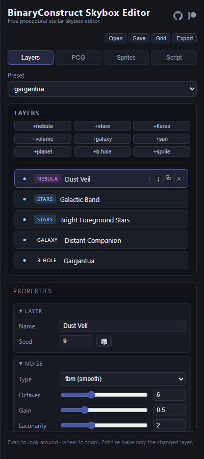
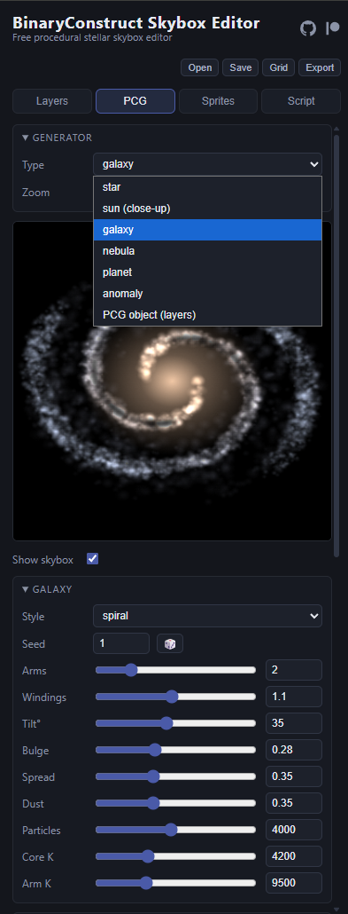
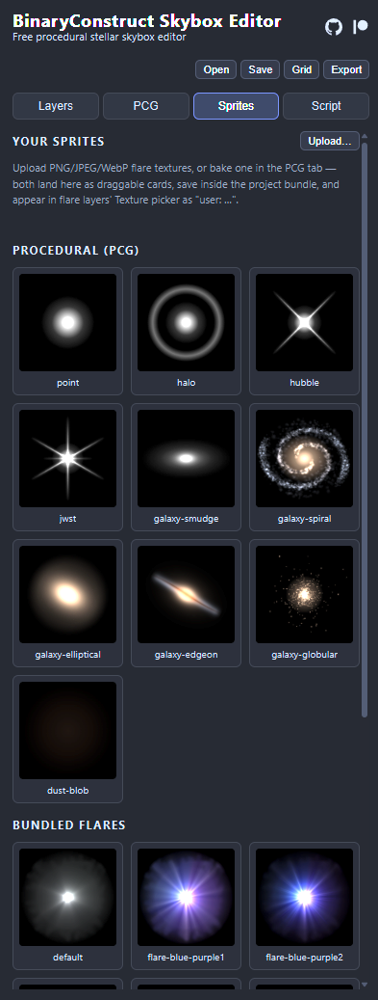
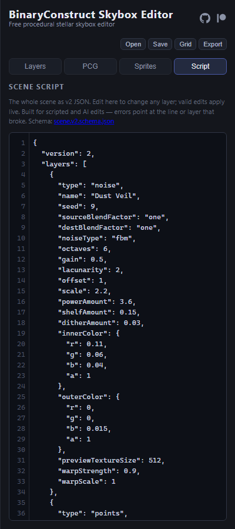

# Using BinaryConstruct Skybox Editor

Everything runs in your browser at [skyboxeditor.com](https://skyboxeditor.com) —
no account, no install. Scenes are deterministic: the same seeds always
produce the same pixels, so a saved scene re-renders identically anywhere.

## Viewport

You stand at the center of the sky sphere.

- **Drag** — look around (right-drag always looks, never grabs objects)
- **Wheel** — zoom (steps through FOV levels)
- **Left-drag a placed object** (sun, planet, galaxy, black hole, sprite) —
  move it across the sky; release to commit. Use the 🔒 toggle on a layer to
  prevent accidental drags.
- **Grid** (top bar) — toggle a lat/lon reference grid (editor-only, never
  exported)

## Layers tab

The scene is a stack of layers composited bottom-to-top, each with its own
blend factors. Start from a **Preset**, or build up with the add buttons:

- **+nebula** — seeded Perlin noise cubemap with color ramps and domain warp
- **+volume** — raymarched volumetric nebula (emission + absorption)
- **+stars** — deterministic point stars (blackbody colors, galactic band)
- **+flares** — textured billboards; mix multiple textures, or place from
  the bundled HYG star catalog
- **+galaxy** — hero spiral galaxy particle cloud (bulge, arms, dust, HII)
- **+sun / +planet** — positional bodies baked from the PCG generators
- **+b.hole** — gravitational lens with geodesic light bending and an
  analytic accretion disc (tilt 0–180°; past 90° the lensed anatomy flips)
- **+sprite** — any texture on a placeable quad

Select a layer to edit it in the **Properties** panel below; every slider
re-bakes only that layer. Reorder with ↑↓ (later layers draw on top),
duplicate with ⧉, toggle visibility with the eye.

## PCG tab

The procedural workbench. Pick a **Type** (star, sun close-up, galaxy,
nebula, planet, anomaly, or a composable PCG object), then a **Style** —
e.g. galaxy morphologies (spiral, elliptical, edge-on, globular,
interacting, deep-field), star classes (O–M, dwarfs, giants, pulsar,
solar-system), planet styles (rocky, terran, gas), anomalies (black hole,
TDE, nova, supernova, kilonova, quasar, SMBH torus, magnetar, pulsar).

- The preview renders in the main viewport — uncheck **Show skybox** for a
  black backdrop.
- **Zoom** scales the object within its sprite.
- **Bake mode**: full color, lightness-only (tinted by the layer that uses
  it), or dark (for multiply-blended dust lanes).
- **Bake to Sprites** saves the result as a reusable sprite; solid bodies
  (stars, planets) carry an occluding flag so they block the sky behind
  them when placed.

## Sprites tab

All placeable textures: your PCG bakes and uploads (saved inside the
project file), the canned procedural set (flare shapes, mini galaxies,
dust blobs), and the bundled flares. **Drag any card into the viewport**
to place it on the sky as a sprite layer, then drag it around, resize,
stretch, and rotate it in the Properties panel.

## Script tab

The whole scene as one JSON document, edited live: valid edits apply
immediately; invalid input gets a red border and an error naming the exact
line or layer/field that broke. The format has a published
[JSON schema](https://skyboxeditor.com/schema/scene.v2.schema.json) —
paste the scene into an AI assistant (or point it at the schema) to
generate or transform skyboxes, then paste the result back.

## Saving and exporting

- **Save** — a plain `.zip` project bundle (scene JSON + your sprites +
  preview). **Open** accepts `.zip` (and legacy `.sspj`), plain scene `.json`, and original
  Spacescape `.xml` saves.
- **Export** — bake the skybox at 512–4096 px/face:
  - cube faces (PNG zip) or a single equirectangular PNG
  - Radiance `.hdr` (e.g. Unreal TextureCube) and OpenEXR (e.g. Godot
    `PanoramaSkyMaterial`), both HDR-capable
  - per-layer faces + a fully flattened composite, plus star positions as
    JSON/CSV data
  - batch seed variations: N deterministic re-rolls of the scene in one zip

## Tips

- Restraint reads better than density: a dark base nebula, two or three
  star layers at different scales, one hero object.
- Additive layers (`one`/`one` blending) ignore alpha — brightness comes
  from color and the HDR multiplier.
- Dark nebula lanes: bake with the **dark** mode and use multiply blending
  (`dest_colour`/`zero`), or drag the procedural dust-blob sprite.
- Deep links: `?preset=<name>` loads a preset directly.
