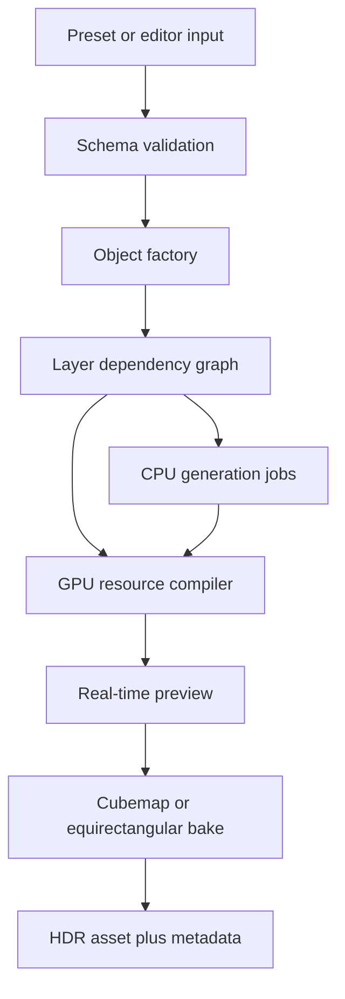

# Procedural Cosmic Skybox Generator

## Object Taxonomy, Composable Render Layers, Mathematics, and TypeScript/Three.js Implementation Specification

**Document status:** supplemental rendering research aligned to the implemented Spacescape-web product
**Product runtime:** fully client-side TypeScript/Three.js browser editor using WebGL2
**Primary outputs:** six-face PNG ZIPs, equirectangular PNG/HDR/EXR skyboxes, per-layer images, particle data, preview thumbnails, and serialized presets
**Audience:** coding agents and graphics programmers
---

## Navigation

* [Purpose and scope](#1-purpose)
* [Implemented product context](#4-implemented-product-context)
* [Conceptual layer model](#5-conceptual-layer-model)
* [Layer rendering techniques](#6-layer-rendering-techniques)
* [Shared mathematics](#7-shared-mathematical-building-blocks)
* [Reusable layer library](#8-reusable-render-layer-library)
* [Astronomical object taxonomy and recipes](#9-astronomical-object-taxonomy-and-layer-recipes)
* [Detailed algorithms](#10-detailed-implementation-algorithms)
* [Behavior and style systems](#11-behavior-and-animation-system)
* [Serialized examples](#13-example-serialized-presets)
* [Skybox baking](#14-skybox-composition-and-baking)
* [Testing and acceptance](#16-validation-testing-and-acceptance-criteria)
* [Layer-customization priorities](#17-supplemental-layer-customization-priorities)
* [Coding-agent layer handoff](#18-coding-agent-layer-handoff)
* [References](#20-authoritative-references)

---

## 1. Purpose

Build a deterministic procedural content generator capable of composing astronomical scenes from independently configurable objects and visual layers. A user must be able to request an object such as a barred spiral galaxy, K-type giant, bipolar planetary nebula, magnetar, comet, or fictional spacetime rift; select a subtype and visual style; enable or remove features; edit every feature independently; preview the result; and bake it into a seamless skybox.

### 1.1 Implemented-product boundary

Spacescape-web is a **browser authoring tool and offline skybox baker**, not a runtime fly-through renderer. Celestial objects are placed by direction and apparent angular size on the celestial sphere. The product does not require camera translation, parallax, navigable astronomical scenes, orbital simulation, or nearby runtime mesh geometry. Exported particle data may be consumed elsewhere to build foreground content, but that is outside the skybox renderer.

The ordinary production workflow must remain browser-native and fully client-side. Blender, CUDA, servers, native compute programs, engine plugins, and a headless CLI may assist future development or automation, but they must not be required for normal authoring or final bakes. Any future CLI should consume the same project format and preserve seeded output.

The broader object taxonomy and rendering equations in this document are supplemental knowledge for customizing existing layers. They are not authorization to replace the existing editor, export system, layer model, or product architecture.

The generator is not a full astrophysical simulation. It is an art-directable renderer whose default presets are visually informed by astronomy. It must support three declared fidelity modes:

1. **Observable:** approximately what a human observer or visible-light camera could see, with exposure controls.
2. **Scientific false color:** non-visible bands mapped into visible RGB, with the mapping recorded in metadata.
3. **Cinematic/fantasy:** physically inspired but intentionally exaggerated or fictional.

Never label a false-color or fantasy preset as physically visible.

### 1.2 Definition of “complete” for this project

Astronomy contains many overlapping catalog classifications and edge cases. “Complete” here means:

* all major object families useful in a game sky;
* the principal scientific subtypes that create a materially different silhouette, color distribution, structure, or time behavior;
* reusable layers for every visible feature named in this document;
* an extension mechanism for rarer catalog labels without changing the renderer core;
* explicit coverage for speculative and fictional anomalies;
* deterministic serialization and enough technical detail to implement each layer.

It does **not** mean encoding every catalog designation in the General Catalogue of Variable Stars, every asteroid taxonomic system, or every transient survey label as a hard-coded renderer class.

---

## 2. Corrections to the Original Draft

The supplied draft is a useful aesthetic starting point, but the implementation must correct the following points.

* Sound does not propagate through a vacuum. Any “rumble,” “clang,” or “roar” belongs in an optional game-audio interpretation, not the astronomical appearance model.
* O- and B-type stars are spectral classes, not synonyms for blue hypergiants. Spectral class and luminosity class are separate axes.
* A contact binary is not automatically a mass-transfer “vampire” system. Detached, semi-detached, contact, common-envelope, and compact accreting binaries need separate recipes.
* The Keplerian circular angular speed is `sqrt(GM / r^3)`, while linear orbital speed is `sqrt(GM / r)`.
* A black hole should not normally be implemented as only a black sphere rendered over the background. The shadow, photon ring, lensed background, lensed far side of the disk, Doppler beaming, and gravitational redshift are the defining visuals.
* A white dwarf is not literally a carbon crystal sphere at all temperatures and compositions. Its visible treatment is a compact hot photosphere; composition is primarily a spectral/preset modifier.
* Neutron-star jets are not universal. Pulsar beams, pulsar-wind nebulae, magnetar bursts, and accretion-powered compact-object jets are independent optional layers.
* “Transparent star surface” is usually the wrong abstraction. A photosphere is visually opaque/emissive; the corona, wind, and prominences are separate translucent or volumetric layers.
* Real stars at skybox distances are point-spread functions, not resolved plasma spheres. The generator needs both **resolved-object** and **distant-impostor** render modes.

NASA distinguishes stellar evolutionary categories from spectral appearance, treats pulsars and magnetars as neutron-star variants, and describes black-hole appearance in terms of the accretion disk, shadow, photon ring, Doppler beaming, corona, and jets. See [NASA Star Types](https://science.nasa.gov/universe/stars/types/) and [NASA Black Hole Anatomy](https://science.nasa.gov/universe/black-holes/anatomy/).

---

## 3. Design Principles

### 3.1 Composition over inheritance

An object is a transform, metadata, parameter set, and ordered graph of layers. Avoid classes such as `QuasarGalaxyWithTwoJets`. Instead compose:

```text
GalaxyObject
  + StellarDiskLayer
  + SpiralArmDensityLayer
  + DustLaneLayer
  + BulgeLayer
  + AGNAccretionDiskLayer
  + DustTorusLayer
  + BipolarJetLayer
  + RelativisticBeamingLayer
```

The same `BipolarJetLayer` can be used by protostars, neutron stars, stellar-mass black holes, active galactic nuclei, and fictional anomalies with different presets.

### 3.2 Separate classification, appearance, and behavior

* **Classification** says what the object is: `star.mainSequence`, `galaxy.spiral.barred`, `nebula.planetary.bipolar`.
* **Appearance layers** say what is rendered: photosphere, spots, arms, dust, jets, shells.
* **Behavior modifiers** say how parameters evolve: rotation, pulsation, eruption, precession, orbit, expansion, flare, lens transit.
* **Observation style** says how radiance becomes the final image: visible, narrowband, infrared false color, cinematic.

This prevents a Cepheid, flare star, eclipsing binary, or blazar from becoming a one-off renderer.

### 3.3 Deterministic generation

Every object, layer, and stochastic sample derives from a stable seed. The same preset, generator version, seed, and output settings must produce byte-identical CPU-generated buffers and visually equivalent GPU output.

Use a named seed path rather than consuming one global random stream:

```ts
const armSeed = hashSeed(scene.seed, object.id, layer.id, "arm-stars");
const dustSeed = hashSeed(scene.seed, object.id, layer.id, "dust-clumps");
```

Adding a new unrelated layer must not reshuffle existing stars.

### 3.4 Physical metadata and angular rendering units

Store scientifically meaningful values with explicit units when they help drive appearance, then convert the result to apparent angular size and normalized layer coordinates for rendering.

* distance: meters, astronomical units, light-years, parsecs;
* mass: kilograms, Earth masses, Jupiter masses, solar masses;
* temperature: kelvin;
* time: seconds, days, years;
* angles: radians internally, degrees in UI;
* wavelength: nanometers;
* radiance/exposure: floating-point HDR values.

The baked-sky product does not place parsec-scale objects in a navigable world. Render celestial layers on the sky sphere using normalized direction vectors and apparent angular dimensions. Physical distance and diameter may remain metadata or inputs used to derive angular size; floating-origin scene infrastructure is not required.

---

## 4. Implemented Product Context



### 4.1 Implemented rendering environment

| Area                            | Product decision                                                               |
| ------------------------------- | ------------------------------------------------------------------------------ |
| Application                     | fully client-side browser editor and offline skybox baker                      |
| Renderer                        | Three.js `WebGLRenderer` with WebGL2/GLSL                                      |
| Required GPU capability         | WebGL2, `EXT_color_buffer_float`, maximum cubemap texture size at least 4096   |
| Verified target class           | current desktop Chrome, Edge, and Firefox; Safari and mobile remain unverified |
| Minimum planning floor          | 8 GB system RAM and 2 GB graphics memory                                       |
| Recommended maximum-export tier | 16 GB system RAM and 4 GB graphics memory                                      |
| Native/offline dependencies     | none required for ordinary authoring or final bakes                            |
| Target consumers                | Unreal Engine 5.8 and Godot 4                                                  |

WebGPU, TSL, storage-buffer compute, native renderers, Blender-assisted final bakes, servers, and engine plugins are outside the present product requirement. They may remain research references, but coding work should not migrate the product away from its browser-native WebGL2 implementation merely to adopt them.

### 4.2 Capability check required before authoring

The application should detect the following at startup and provide an actionable failure message rather than beginning a bake that cannot complete:

* WebGL2 context creation;
* `EXT_color_buffer_float` availability;
* `MAX_CUBE_MAP_TEXTURE_SIZE >= 4096` for maximum-resolution export;
* available texture/renderbuffer limits needed by the selected export;
* a conservative memory warning for 4096-per-face HDR work.

Safari and mobile support must not be claimed until tested. A missing capability should lower the selectable maximum resolution only when the reduced path has been explicitly verified.

---

## 5. Conceptual Layer Model

This section is descriptive vocabulary for discussing layer recipes. It is not a proposal to replace the implemented Spacescape-web schema, registry, editor state, or render pipeline. Existing project types remain authoritative.

### 5.1 TypeScript interfaces

```ts
type FidelityMode = "observable" | "scientificFalseColor" | "cinematic";
type RenderPhase =
  | "background"
  | "opaque"
  | "emissive"
  | "transparent"
  | "volume"
  | "distortion"
  | "post";

type RenderPrimitive =
  | "sprite"
  | "mesh"
  | "points"
  | "instancedMesh"
  | "ribbon"
  | "tube"
  | "volume"
  | "sdfRaymarch"
  | "screenSpace";

interface Quantity {
  value: number;
  unit: string;
}

interface TransformSpec {
  position: [number, number, number];
  rotation:
    | { kind: "quaternion"; value: [number, number, number, number] }
    | { kind: "eulerRadians"; value: [number, number, number]; order: "XYZ" | "YXZ" | "ZXY" | "ZYX" | "YZX" | "XZY" };
  scale: [number, number, number];
  frame?: "celestialSphere" | string;
}

interface ParameterDescriptor<T = unknown> {
  id: string;
  label: string;
  type: "number" | "integer" | "boolean" | "color" | "enum" | "curve" | "gradient" | "vector2" | "vector3";
  default: T;
  min?: number;
  max?: number;
  step?: number;
  unit?: string;
  options?: readonly string[];
  description: string;
  realism?: "physical" | "approximation" | "artistic";
}

interface LayerSpec<P extends Record<string, unknown> = Record<string, unknown>> {
  id: string;
  type: string;
  enabled: boolean;
  seed?: string | number;
  phase: RenderPhase;
  primitive: RenderPrimitive;
  blendMode: "opaque" | "alpha" | "premultipliedAlpha" | "add" | "multiply" | "screen" | "min" | "max";
  parameters: P;
  maskInputs?: string[];
  dependsOn?: string[];
  transform?: TransformSpec;
  tags?: string[];
}

interface CelestialObjectSpec {
  schemaVersion: string;
  generatorVersion: string;
  id: string;
  name: string;
  classId: string;
  subtypeIds: string[];
  fidelity: FidelityMode;
  transform: TransformSpec;
  physical?: Record<string, Quantity | number | string | boolean>;
  layers: LayerSpec[];
  behaviors: BehaviorSpec[];
  observation: ObservationSpec;
  metadata?: Record<string, unknown>;
}
```

Names in this example are illustrative. Adapt layer descriptions to the existing product types rather than introducing parallel interfaces.

### 5.2 Layer execution contract

Each layer implementation should expose:

```ts
interface CompiledLayer {
  readonly id: string;
  readonly bounds: THREE.Box3 | THREE.Sphere;
  update(frame: FrameContext): void;
  setParameter(path: string, value: unknown): UpdateCost;
  render(pass: RenderPassContext): void;
  dispose(): void;
}

type UpdateCost = "uniformOnly" | "bufferUpdate" | "shaderRecompile" | "fullRegenerate";
```

The editor can then debounce expensive changes while keeping colors, intensities, and animation speeds interactive.

### 5.3 Dependency examples

* `dust-lanes` depends on `spiral-arms` for its centerline field.
* `star-forming-knots` consumes the arm density and dust density masks.
* `bloom` depends on the combined emissive buffer.
* `black-hole-lensing` reads the opaque/background HDR buffer and depth.
* `atmosphere` reads a planet radius and primary light direction.
* `comet-ion-tail` reads the host-star direction but not the dust-tail geometry.

Detect cycles during validation and return a human-readable error.

---

## 6. Layer Rendering Techniques

These are techniques that may be used inside the existing sky-sphere renderer. Mesh, tube, and volume language describes how a layer can be generated before it is baked; it does not imply navigable runtime geometry.

| Primitive                | Best for                                       | Main implementation                                 | Limitations                                             |
| ------------------------ | ---------------------------------------------- | --------------------------------------------------- | ------------------------------------------------------- |
| Analytic sprite/impostor | distant stars, compact objects, small galaxies | camera-facing quad, analytic PSF in fragment shader | no close parallax or resolved silhouette                |
| Mesh                     | photospheres, planets, asteroids               | sphere/icosphere/custom geometry                    | expensive for enormous populations                      |
| Instanced mesh           | star knots, asteroids, ring chunks             | shared geometry/material with per-instance data     | transparency sorting is limited                         |
| Point cloud              | galaxy stars, debris, jets                     | `BufferGeometry` + custom point shader              | point-size limits; use quads for large particles        |
| Ribbon/tube              | plasma stream, tail, filament, magnetic guide  | curve sampling + strip/tube geometry                | can look artificial without noise and taper             |
| Shell mesh               | shock wave, planetary nebula lobe              | displaced sphere/ellipsoid with depth fade          | overlapping transparency artifacts                      |
| SDF raymarch             | smooth lobes, rings, wormholes                 | full bounds mesh and signed-distance shader         | step count and aliasing cost                            |
| Volume raymarch          | nebulae, clouds, coronae                       | 3D density texture or procedural density function   | fill-rate heavy; requires careful temporal stability    |
| Screen-space distortion  | gravitational lens, heat/rift distortion       | render target sample with UV deflection             | cannot reveal data never rendered outside source buffer |
| Baked texture            | final skybox and distant complex objects       | cubemap/equirectangular HDR                         | no internal parallax or dynamic layer editing           |

---

## 7. Shared Mathematical Building Blocks

### 7.1 Seeded random sampling

Use a 32- or 64-bit deterministic PRNG such as PCG or xoshiro. For a uniform point on a sphere:

[
z = 1 - 2u,\qquad \phi = 2\pi v,\qquad
\mathbf{p} = (\sqrt{1-z^2}\cos\phi,\sqrt{1-z^2}\sin\phi,z)
]

Do not choose latitude uniformly; that overpopulates the poles.

### 7.2 Blackbody color and radiance

Use Planck's spectral radiance for physical temperature presets:

[
B_\lambda(\lambda,T)=\frac{2hc^2}{\lambda^5}\frac{1}{e^{hc/(\lambda k_B T)}-1}
]

Sample the visible band, multiply by approximate CIE color-matching functions, integrate to XYZ, transform to linear sRGB, normalize for display, and retain a separate physical/intensity scalar. Wien's displacement law supplies the peak wavelength:

[
\lambda_{\max}=\frac{b}{T}
]

Do not interpolate star colors directly in sRGB. NASA's [blackbody curve explainer](https://science.nasa.gov/asset/webb/continuous-spectra-blackbody-curves-of-stars/) is a useful scientific reference.

### 7.3 Noise, fBm, ridges, and domain warp

Base fractal Brownian motion:

[
f(\mathbf p)=\sum_{i=0}^{N-1} a_0 g^i;n(\mathbf p,f_0,l^i+\mathbf o_i)
]

where `g` is gain, `l` is lacunarity, and `n` is a signed gradient/simplex noise function. Useful variants:

* turbulence: `sum(a_i * abs(n_i))`;
* ridged: `sum(a_i * (1 - abs(n_i))^2)`;
* domain warp: `f(p + warpStrength * q(p))`;
* curl field: `curl(noiseVectorField)` for divergence-free motion.

For seamless skyboxes, evaluate noise from the normalized 3D view direction or world-space position. Do not evaluate independent 2D noise per cubemap face.

### 7.4 Smooth masks and signed-distance fields

```glsl
float band(float x, float center, float halfWidth, float feather) {
  return 1.0 - smoothstep(halfWidth, halfWidth + feather, abs(x - center));
}

float softSphereSdf(vec3 p, float r) { return length(p) - r; }
float softEllipsoidApprox(vec3 p, vec3 radii) {
  return (length(p / radii) - 1.0) * min(radii.x, min(radii.y, radii.z));
}
```

Combine SDFs with union `min(a,b)`, intersection `max(a,b)`, subtraction `max(a,-b)`, and polynomial smooth-min for blended lobes.

### 7.5 Volume integration

For ray step length `Δs`, extinction coefficient `σ_t`, density `ρ`, emission `j`, and accumulated transmittance `T`:

[
\alpha=1-e^{-\sigma_t\rho\Delta s},\qquad
\mathbf C \leftarrow \mathbf C + T\alpha\mathbf j,\qquad
T \leftarrow T(1-\alpha)
]

Stop when `T < 0.01`. Use empty-space bounds, blue-noise jitter, adaptive step size, and temporal accumulation for quality. A single-scattering option can use Henyey-Greenstein phase:

[
P(\cos\theta)=\frac{1-g^2}{4\pi(1+g^2-2g\cos\theta)^{3/2}}
]

### 7.6 Fresnel-like rim glow

For stylized thin emission around a sphere:

[
F=(1-\max(0,\mathbf n\cdot\mathbf v))^p
]

This is a useful art layer but is not a substitute for a physical stellar corona or planetary atmosphere.

### 7.7 Orbital motion

Circular orbit:

[
v=\sqrt{\frac{GM}{r}},\qquad \omega=\sqrt{\frac{GM}{r^3}}
]

For eccentric motion, solve Kepler's equation `M = E - e sin(E)` with Newton iteration, then convert eccentric anomaly `E` to true anomaly. Position two bodies around the barycenter using `r1 = a m2/(m1+m2)` and `r2 = a m1/(m1+m2)`.

### 7.8 Approximate Roche-lobe radius

For mass ratio `q = M1/M2`, Eggleton's approximation is useful for deciding whether a star fills its lobe:

[
\frac{R_{L,1}}{a}=\frac{0.49q^{2/3}}{0.6q^{2/3}+\ln(1+q^{1/3})}
]

Use this as a visual rule for detached/semi-detached/contact presets, not as a hydrodynamics solver.

### 7.9 Logarithmic spiral arms

An arm centerline can be written:

[
r(\theta)=r_0,e^{(\theta-\theta_0)\tan p}
]

where `p` is pitch angle. For `m` arms, offset arm `k` by `2πk/m`. Define arm density from wrapped angular distance to the nearest centerline, add radius-dependent width, clumps, spurs, and a smooth inner/outer falloff.

### 7.10 Galaxy light profiles

Exponential disk:

[
\Sigma_d(R)=\Sigma_0e^{-R/R_d}
]

Sérsic bulge/elliptical:

[
I(R)=I_e\exp\left[-b_n\left(\left(\frac{R}{R_e}\right)^{1/n}-1\right)\right]
]

Use `n≈1` for disk-like profiles and `n≈4` as a common classical-bulge/elliptical starting point, then expose `n`. Modern decomposition work continues to use Sérsic bulges plus exponential disks; see [MNRAS: Galaxies decomposition with spiral arms](https://academic.oup.com/mnras/article/527/4/9605/7472098).

### 7.11 Relativistic helper values

Schwarzschild radius:

[
r_s=\frac{2GM}{c^2}
]

Simple thin-lens Einstein angle for point mass:

[
\theta_E=\sqrt{\frac{4GM}{c^2}\frac{D_{LS}}{D_LD_S}}
]

Relativistic Doppler factor:

[
\delta=\frac{1}{\gamma(1-\beta\cos\theta)},\qquad \gamma=\frac{1}{\sqrt{1-\beta^2}}
]

Use these for parameterization and approximations. A physically credible near-black-hole image requires null-geodesic ray integration or a precomputed transfer function, not a generic radial UV swirl.

---

## 8. Reusable Render-Layer Library

Every layer below is independently toggleable unless marked as a required base. Parameters listed are the minimum public controls; implementations may have hidden technical settings.

### 8.1 Background and imaging layers

| Layer ID                      | Visual result                                                 | Primary parameters                                                                  | Math/implementation                                                                           |
| ----------------------------- | ------------------------------------------------------------- | ----------------------------------------------------------------------------------- | --------------------------------------------------------------------------------------------- |
| `background.starField`        | unresolved stars with density, magnitude, and color variation | count, magnitude range, temperature distribution, galactic-plane bias, twinkle mode | importance-sampled sprites/points; flux from magnitude `F/F0=10^(-0.4m)`; no twinkle in space |
| `background.milkyWayBand`     | broad mottled stellar band with dark rifts                    | plane normal, width, bulge direction, intensity, dust amount                        | direction-space density band + fBm; multiply by dust optical-depth mask                       |
| `background.zodiacalLight`    | faint triangular glow around star/ecliptic                    | plane, forward-scatter, radial decay                                                | dust disk density + HG phase approximation                                                    |
| `imaging.psf`                 | airy-like core, halo, diffraction spikes                      | aperture style, spike count, halo, chromatic aberration                             | analytic screen-space PSF; observational artifact, not object geometry                        |
| `imaging.exposure`            | HDR to display transform                                      | EV, white point, tone mapper                                                        | linear HDR; ACES-like or neutral tone mapping                                                 |
| `imaging.bloom`               | glow around bright sources                                    | threshold, knee, radius, intensity                                                  | multi-resolution emissive-buffer blur; never bake bloom into base albedo                      |
| `imaging.chromaticFalseColor` | wavelength channels mapped to RGB                             | band-to-color mapping, channel curves                                               | per-layer spectral tags -> declared RGB transform                                             |
| `imaging.film`                | cinematic grain/vignette/halation                             | grain, vignette, halation                                                           | final post pass; disabled in observable defaults                                              |

### 8.2 Stellar surface and environment layers

| Layer ID                  | Visual result                         | Primary parameters                                        | Math/implementation                                                            |
| ------------------------- | ------------------------------------- | --------------------------------------------------------- | ------------------------------------------------------------------------------ |
| `star.photosphere`        | opaque luminous stellar sphere        | radius, temperature, luminosity, limb darkening, rotation | sphere or impostor; blackbody-derived linear RGB; limb law `I(μ)=I0(1-u(1-μ))` |
| `star.granulation`        | cellular boiling texture              | cell scale, contrast, lifetime, advection                 | 3D Worley/gradient-noise mix sampled on sphere; temporal domain offsets        |
| `star.convectionCells`    | very large irregular cells on giants  | cell count, amplitude, temperature delta                  | low-frequency spherical noise; optional normal displacement                    |
| `star.spots`              | cooler irregular dark spots           | coverage, latitude bands, size distribution, lifetime     | spherical cap/SDF masks with warped boundaries; lower local temperature        |
| `star.faculae`            | bright magnetic regions near spots    | association, rim width, contrast                          | dilated spot mask minus spot core; limb-dependent brightness                   |
| `star.oblateness`         | equatorial bulge from rapid rotation  | flattening, spin axis                                     | scale sphere to oblate spheroid; optional gravity-darkening gradient           |
| `star.corona`             | faint extended hot halo and streamers | extent, falloff, streamer count, activity                 | layered shells or sparse volume; radial falloff with elongated noise           |
| `star.prominence`         | arching plasma loops                  | count, height, thickness, brightness                      | Bezier/tube or ribbon loops rooted at surface; animated flow texture           |
| `star.flare`              | localized flash and ejecta            | energy, duration, latitude, ejecta speed                  | light curve envelope + expanding ribbon/particle burst                         |
| `star.wind`               | radial/anisotropic outflow            | mass-loss style, speed, density, clumping                 | GPU particles or volume; velocity `v(r)=v∞(1-R*/r)^β` approximation            |
| `star.pulsation`          | radius and luminosity cycle           | period, radius amplitude, phase, temperature amplitude    | curve-driven scale and radiance; non-radial modes use spherical harmonics      |
| `star.variableLightCurve` | generic time-varying brightness       | curve, period, phase, stochastic component                | sampled periodic curve or Fourier series; can drive multiple parameters        |

### 8.3 Disk, flow, jet, and compact-object layers

| Layer ID                | Visual result                                  | Primary parameters                                                       | Math/implementation                                                                     |
| ----------------------- | ---------------------------------------------- | ------------------------------------------------------------------------ | --------------------------------------------------------------------------------------- |
| `disk.accretion`        | hot rotating disk, inner bright region         | inner/outer radius, thickness, temperature exponent, opacity, turbulence | annular mesh/volume; `T(r)=Tin(r/rin)^(-q)`; animate azimuthal noise with Keplerian `ω` |
| `disk.protoplanetary`   | cooler dusty disk with rings/gaps              | radius, flare, gap list, dust bands, inclination                         | flared disk `H(r)=H0(r/r0)^β`; volumetric or layered annuli                             |
| `disk.debris`           | optically thin dust and planetesimal belt      | inner/outer radius, eccentricity, clumps                                 | instanced particles with size distribution; optional resonant gaps                      |
| `disk.dustTorus`        | thick obscuring torus                          | major/minor radius, clumpiness, opening angle, optical depth             | torus SDF volume + clumped density; multiplicative extinction                           |
| `flow.rocheLobe`        | optional debug/fictional equipotential outline | mass ratio, separation, iso-value                                        | sample rotating-frame potential; marching cubes or shader contour                       |
| `flow.massTransfer`     | curved stream from donor through L1            | width, rate, temperature, turbulence                                     | ballistic guide curve + ribbon/tube + particles; taper and impact hotspot               |
| `flow.commonEnvelope`   | both stars inside turbulent envelope           | radius, density, rotation, ejection spirals                              | shared volume with two cavities and spiral outflow masks                                |
| `flow.tidalDisruption`  | stellar stream wrapping black hole             | stream length, fallback rate, spread                                     | particles along eccentric trajectories with differential orbital phase                  |
| `jet.bipolar`           | two opposed collimated outflows                | length, opening angle, knots, speed, precession, brightness              | cone/frustum density or particles; helical/precessing centerline                        |
| `jet.terminalLobe`      | radio-lobe-like inflated ends                  | lobe radius, cocoon, hotspot                                             | ellipsoid SDF volumes plus terminal emissive cap                                        |
| `compact.pulsarBeam`    | lighthouse beams from magnetic poles           | magnetic tilt, beam width, rotation period, falloff                      | paired cones/volumes attached to rotating magnetic axis                                 |
| `compact.photonRing`    | thin lensed rings at shadow edge               | ring radius, subring count, falloff                                      | analytic approximation or output of geodesic transfer texture                           |
| `compact.lensing`       | warped background and disk                     | mass, spin approximation, camera pose, quality                           | screen-space ray deflection for low tier; geodesic raymarch/lookup for high tier        |
| `compact.magnetosphere` | stylized field arcs and plasma                 | dipole tilt, line count, plasma density                                  | trace dipole field `B ∝ (3rhat(m·rhat)-m)/r^3`; render selected lines/ribbons           |
| `compact.starquake`     | crust flash and expanding magnetar pulse       | location, energy, duration                                               | localized emissive crack mask + expanding shell; cinematic visualization                |

### 8.4 Nebular, cloud, shell, and transient layers

| Layer ID                      | Visual result                           | Primary parameters                                       | Math/implementation                                                              |
| ----------------------------- | --------------------------------------- | -------------------------------------------------------- | -------------------------------------------------------------------------------- |
| `volume.molecularCloud`       | cold, opaque, knotted cloud             | bounds, density, clumping, filaments, cavities           | fBm + ridged noise + domain warp in a volume; strong extinction, weak emission   |
| `volume.emissionGas`          | glowing ionized gas                     | density source, ionization color, emissivity, shell bias | emission proportional to a power of density; optional distance to ionizing stars |
| `volume.reflectionDust`       | blue/neutral scattered starlight        | dust density, illuminator, anisotropy, albedo            | single scattering with HG phase; shadow/transmittance toward light               |
| `volume.darkDust`             | silhouette and dust lanes               | optical depth, clump size, color                         | Beer-Lambert extinction; mostly multiply/transmittance rather than black paint   |
| `volume.cavity`               | hollow region carved by wind/radiation  | center, radius, shell width, irregularity                | subtract sphere/ellipsoid SDF from density; accumulate material at boundary      |
| `shell.shockFront`            | thin bright expanding rim               | radius, thickness, speed, asymmetry                      | shell SDF `abs(length(p)-r)-t`; noise-displaced radius; age drives expansion     |
| `shell.filaments`             | tangled wisps at shock edges            | count, curl, width, brightness                           | advected curves or ridge field concentrated near shell                           |
| `shell.bipolarLobes`          | hourglass/butterfly lobes               | lobe length, waist, pinch, asymmetry                     | smooth-union ellipsoid/cone SDFs; density at surfaces                            |
| `shell.rings`                 | nested circular/elliptical ejecta rings | count, radii, tilt, thickness                            | torus SDFs or ribbon loops                                                       |
| `transient.ejecta`            | expanding particulate debris            | velocity distribution, anisotropy, drag, color evolution | ballistic particle positions `p=p0+vt`; homologous expansion `v∝r`               |
| `transient.lightEcho`         | expanding illuminated sheets/rings      | source curve, dust planes, time                          | intersection of light-echo paraboloid with dust density; artistic shell fallback |
| `transient.gravitationalWave` | visible spacetime ripple metaphor       | amplitude, wavelength, polarization                      | post-process coordinate deformation; always tag as non-visible visualization     |

### 8.5 Galaxy structure layers

| Layer ID                  | Visual result                           | Primary parameters                                               | Math/implementation                                                               |   |                      |
| ------------------------- | --------------------------------------- | ---------------------------------------------------------------- | --------------------------------------------------------------------------------- | - | -------------------- |
| `galaxy.stellarDisk`      | thin exponential star disk              | scale length, thickness, truncation, star count, age mix         | importance sample `Σ(R)` and vertical `exp(-                                      | z | /hz)`or`sech²(z/hz)` |
| `galaxy.thickDisk`        | older, puffier disk                     | scale length, height, color/age                                  | second exponential component with larger scale height                             |   |                      |
| `galaxy.bulge`            | bright spheroidal center                | Sérsic index, effective radius, flattening, color                | sample projected/3D approximation of Sérsic profile                               |   |                      |
| `galaxy.bar`              | elongated central stellar bar           | length, axis ratio, boxiness, angle                              | Ferrers-like ellipsoid or superellipse density; tapered ends                      |   |                      |
| `galaxy.spiralArms`       | countable curved arms                   | count, pitch angle, width, contrast, start/end radius, branching | logarithmic centerlines + angular distance mask; perturb with low-frequency noise |   |                      |
| `galaxy.armSpurs`         | feathered branches off major arms       | frequency, length, pitch offset, strength                        | secondary short logarithmic segments seeded from arms                             |   |                      |
| `galaxy.dustLanes`        | dark lanes, often inner arm edges       | offset, width, optical depth, clumping                           | derive from arm field with phase offset; extinction volume/particles              |   |                      |
| `galaxy.starFormingKnots` | blue clusters and pink emission regions | density, arm bias, size, lifetime                                | clustered point process sampled from arms × gas mask                              |   |                      |
| `galaxy.gasDisk`          | diffuse ionized/neutral disk            | radius, thickness, holes, color mapping                          | low-resolution volume or layered transparent disk                                 |   |                      |
| `galaxy.stellarHalo`      | sparse spherical old stars              | radius, falloff, flattening, substructure                        | power-law density + streams; points/impostors                                     |   |                      |
| `galaxy.globularClusters` | compact points around halo              | count, radial distribution, brightness                           | instanced sprites sampled from halo distribution                                  |   |                      |
| `galaxy.warp`             | outer disk bends above/below plane      | onset radius, amplitude, phase                                   | `z += A smoothstep(Rw,Rmax,R) sin(φ-φw)`                                          |   |                      |
| `galaxy.ring`             | stellar/gas ring                        | radius, width, eccentricity, clumps                              | annular density/SDF; may coexist with bar or collision wave                       |   |                      |
| `galaxy.polarRing`        | ring perpendicular to main disk         | tilt, radius, width                                              | separate ring layer with independent transform                                    |   |                      |
| `galaxy.tidalTail`        | long curved stellar/gas stream          | length, curvature, width, knots                                  | spline ribbon + particles with tapered density                                    |   |                      |
| `galaxy.shells`           | faint concentric merger arcs            | count, spacing, coverage, sharpness                              | partial ellipsoidal shell masks                                                   |   |                      |
| `galaxy.asymmetry`        | lopsidedness and irregularity           | mode amplitudes, clumpiness                                      | azimuthal Fourier perturbation `1+ΣAk cos(kφ+φk)`                                 |   |                      |
| `galaxy.agnCore`          | unresolved over-bright nucleus          | luminosity, variability, PSF                                     | HDR sprite/compact emissive source feeding bloom                                  |   |                      |

### 8.6 Planet, small-body, and local-environment layers

| Layer ID                   | Visual result                   | Primary parameters                                        | Math/implementation                                                      |
| -------------------------- | ------------------------------- | --------------------------------------------------------- | ------------------------------------------------------------------------ |
| `planet.surface`           | rocky/icy/ocean surface         | radius, terrain spectrum, albedo palette, roughness       | cube-sphere or icosphere; 3D directional noise avoids seams              |
| `planet.atmosphere`        | colored limb and haze           | scale height, Rayleigh/Mie coefficients, ozone/absorption | precomputed scattering LUT for quality; shell approximation for low tier |
| `planet.clouds`            | rotating cloud bands/storms     | coverage, levels, wind, storms                            | shell layers with advected noise; gas giants use latitude-dependent flow |
| `planet.cityLights`        | night-side emissive networks    | density, coastline bias, color                            | mask by `max(0,-N·L)`; fictional/inhabited modifier                      |
| `planet.aurora`            | polar curtains                  | oval radius, curtain height, activity                     | magnetic-pole ribbons with animated vertical rays                        |
| `planet.rings`             | flat particle rings and gaps    | inner/outer radius, optical depth curve, gap list, tilt   | instanced grains for close view; textured annulus for distance           |
| `planet.volcanism`         | hotspots, plumes, lava          | hotspot list, plume height, rate                          | emissive surface decals + ballistic/volume plumes                        |
| `smallbody.irregularShape` | asteroid/comet nucleus          | size, elongation, crater amount, rubble                   | low-frequency displacement of icosphere or SDF/marching cubes            |
| `smallbody.craters`        | bowl depressions and rims       | count, size power law, depth                              | offline displacement mask; shader parallax/normal fallback               |
| `comet.coma`               | diffuse head around nucleus     | radius, production rate, asymmetry                        | radial volume density with sunward enhancement                           |
| `comet.dustTail`           | broad curved yellow/white tail  | length, spread, grain sizes, radiation pressure           | particles with size-dependent acceleration; spline approximation         |
| `comet.ionTail`            | narrow blue tail away from star | length, turbulence, disconnection events                  | ribbon/particles aligned anti-stellar with solar-wind noise              |
| `debris.meteor`            | short bright moving streak      | speed, lifetime, head/tail colors                         | camera-space ribbon; atmospheric phenomenon only near a planet           |

### 8.7 Anomaly layers

| Layer ID                | Visual result                                   | Primary parameters                                             | Math/implementation                                                         |
| ----------------------- | ----------------------------------------------- | -------------------------------------------------------------- | --------------------------------------------------------------------------- |
| `anomaly.wormhole`      | lensed spherical/torus portal to another sky    | throat radius, mouth shape, destination cubemap, lens strength | ray direction remap through analytic throat approximation; SDF mouth rim    |
| `anomaly.cosmicString`  | thin line producing duplicated background       | direction, deficit angle, glow                                 | screen-space split/duplicate across line; optional nonphysical visible core |
| `anomaly.rift`          | torn luminous seam in space                     | spline, width, branches, interior sky                          | screen-space SDF to curve, edge emission, displacement, secondary cubemap   |
| `anomaly.void`          | unnaturally starless region with rim distortion | shape, depletion, lensing, rim                                 | mask background objects by volume; optional screen-space deflection         |
| `anomaly.energyShell`   | nested geometric wavefronts                     | shape, count, speed, interference                              | SDF shells + additive emission + animated phase                             |
| `anomaly.crystal`       | faceted luminous celestial structure            | symmetry, facets, refraction, inclusions                       | procedural polyhedron/CSG; physical material or stylized shader             |
| `anomaly.megastructure` | ringworld, Dyson swarm, shell, orbital lattice  | architecture type, coverage, module count                      | instanced modules on orbital distributions; occlusion of host star          |
| `anomaly.beacon`        | artificial periodic beam/pulse                  | cadence, beam geometry, encoding                               | deterministic light curve + collimated beam layer                           |

---

## 9. Astronomical Object Taxonomy and Layer Recipes

The layer lists are default recipes, not restrictions. `+` means normally present, `?` optional, and behavior modifiers follow after `@`.

## 9.1 Stars: classification axes

Do not encode a star as a single enum. A useful star preset is the product of several axes:

```text
evolutionary stage × spectral class × luminosity class × peculiar type
× rotation/magnetism × variability × multiplicity × observation style
```

### Spectral and temperature sequence

| Class | Approximate appearance                       | Typical resolved rendering cues                                           |
| ----- | -------------------------------------------- | ------------------------------------------------------------------------- |
| O     | blue-violet/blue-white, extremely hot        | intense compact photosphere, strong wind/corona; often bloom-dominated    |
| B     | blue-white                                   | smooth hot photosphere; optional rapid rotation/Be disk                   |
| A     | white to blue-white                          | bright white photosphere; weaker convection texture                       |
| F     | yellow-white                                 | subtle granulation and moderate activity                                  |
| G     | white-yellow after display adaptation        | solar-like granulation, spots, prominences, corona                        |
| K     | pale orange                                  | larger convection contrast, orange photosphere                            |
| M     | orange-red, coolest normal stars             | strong molecular-band color treatment; active dwarf flares or giant cells |
| L     | deep red/near-infrared brown dwarf           | faint visible emission, clouds/hazes dominate close concept art           |
| T     | very faint visible, methane-rich brown dwarf | cool banded cloud appearance; prefer IR false color                       |
| Y     | extremely cool brown dwarf                   | essentially invisible in observable visible mode; thermal-IR preset       |

The OBAFGKM sequence is temperature-based; ESA/Hubble provides a concise [spectral classification overview](https://esahubble.org/wordbank/star/). L/T/Y are substellar brown-dwarf classes and should be stored in the same spectral appearance field but classified as substellar objects.

### Luminosity/evolution axis

| Category                      | Class examples                                     | Default visual differences                                             |
| ----------------------------- | -------------------------------------------------- | ---------------------------------------------------------------------- |
| Protostar / pre-main-sequence | Class 0/I/II/III SED stages, T Tauri, Herbig Ae/Be | embedded dust, disk, jets, hot accretion spots                         |
| Main sequence/dwarf           | V                                                  | stable sphere; surface structure depends on temperature and activity   |
| Subgiant                      | IV                                                 | larger radius, slightly cooler extended appearance                     |
| Giant                         | III                                                | expanded photosphere, larger convection cells, pulsation/wind optional |
| Bright giant                  | II                                                 | strong mass loss and atmospheric extension                             |
| Supergiant                    | Ib/Iab/Ia                                          | large irregular cells, strong wind, variability                        |
| Hypergiant                    | Ia+ descriptive category                           | extreme mass loss, shells/ejecta, instability                          |
| White dwarf                   | remnant; separate DA/DB/etc. spectral scheme       | tiny hot smooth photosphere, thin halo, debris/accretion optional      |
| Neutron star                  | compact remnant                                    | tiny hot surface, hotspots, beam/magnetosphere optional                |
| Black hole                    | compact object by mass class                       | no luminous surface; lensing/accretion layers define appearance        |

### Peculiar and special stellar presets

| Subtype                     | Visual identity                                            | Default recipe                                                                         |
| --------------------------- | ---------------------------------------------------------- | -------------------------------------------------------------------------------------- |
| Wolf-Rayet WN/WC/WO         | hot core inside powerful clumpy wind; possible ring nebula | `star.photosphere + star.wind + star.corona ? shell.shockFront ? volume.emissionGas`   |
| Luminous blue variable      | blue luminous star with unstable ejecta shells             | base hot supergiant `+ star.wind + shell.rings + transient.ejecta @ irregularEruption` |
| Be star                     | rapidly rotating B star with equatorial decretion disk     | `star.photosphere + star.oblateness + disk.accretion(decretion preset)`                |
| Carbon star                 | deep orange/red giant with dusty envelope                  | cool giant `+ star.convectionCells + star.wind + volume.darkDust`                      |
| S-type star                 | red giant intermediate molecular chemistry                 | cool giant palette modifier + dust/wind options                                        |
| T Tauri                     | young active low-mass star                                 | `star.photosphere + star.spots + star.flare + disk.protoplanetary ? jet.bipolar`       |
| Herbig Ae/Be                | young intermediate-mass hot star                           | hot photosphere `+ disk.protoplanetary + volume.reflectionDust ? jet.bipolar`          |
| Blue straggler              | unusually blue/luminous cluster member                     | normal hot-star recipe; classification affects population sampling, not unique shader  |
| Hot subdwarf                | small hot blue star                                        | compact photosphere, high temperature, minimal resolved turbulence                     |
| Chemically peculiar / Ap/Bp | spectral peculiarity and strong fields                     | photosphere + spots + optional stylized magnetosphere                                  |

NASA defines Wolf-Rayet stars by hot luminous spectra and strong winds in its [Universe glossary](https://science.nasa.gov/universe/glossary/). The renderer should represent that primarily through wind and surrounding-gas layers, not a unique geometry class.

### Variable-star modifiers

AAVSO divides variables into intrinsic and extrinsic groups, including pulsating, eruptive, cataclysmic, eclipsing, and rotating classes. See the [AAVSO variable-star guide](https://www.aavso.org/types-of-variables-guide-for-beginners). Implement these as behaviors:

| Modifier            | Important subtypes                             | Driven parameters                                               |
| ------------------- | ---------------------------------------------- | --------------------------------------------------------------- |
| Radial pulsator     | Cepheid, RR Lyrae, Mira, semiregular           | radius, temperature, luminosity, sometimes wind/dust            |
| Non-radial pulsator | Delta Scuti, Beta Cephei, white-dwarf pulsator | low-amplitude surface displacement via spherical-harmonic modes |
| Rotating/spotted    | BY Dra, Alpha2 CVn                             | spot transform and integrated brightness                        |
| Eruptive            | UV Ceti flare star, R CrB fading, LBV          | flare events, dust ejection, irregular light curve              |
| Eclipsing           | Algol/EA, Beta Lyrae/EB, W UMa/EW              | orbit, occlusion, reflection/heating, ellipsoidal deformation   |
| Cataclysmic         | nova, dwarf nova, recurrent nova               | disk luminosity, hotspot, ejecta shell, outburst curve          |
| Microlensing event  | point lens or binary lens                      | screen-space magnification/distortion of background source      |

## 9.2 Stellar systems and binaries

| System type           | Visual description                                       | Default layers and behaviors                                                |
| --------------------- | -------------------------------------------------------- | --------------------------------------------------------------------------- |
| Wide/detached binary  | two distinct stars orbiting barycenter                   | two star recipes `@ keplerOrbit`; optional eclipses based on inclination    |
| Close detached        | distorted/irradiated faces but no stream                 | two photospheres `+ star.oblateness/ellipsoidal + heating mask @ orbit`     |
| Semi-detached         | donor fills Roche lobe; narrow stream to companion/disk  | stars `+ flow.massTransfer + disk.accretion + impact hotspot`               |
| Contact binary        | two Roche-distorted photospheres sharing a neck/envelope | smooth-union Roche-like surfaces `+ flow.commonEnvelope @ orbit`            |
| Common-envelope event | compact cores inside expanding turbulent gas             | two cores `+ flow.commonEnvelope + transient.ejecta`                        |
| X-ray binary          | normal donor plus neutron star/black hole and hot disk   | donor `+ flow.massTransfer + disk.accretion ? jet.bipolar`                  |
| Symbiotic binary      | red giant wind feeding white dwarf                       | red giant + white dwarf `+ star.wind + disk.accretion + volume.emissionGas` |
| Double compact object | WD/NS/BH pair                                            | compact recipes `@ inspiral`; optional declared GW visualization            |

## 9.3 Compact remnants

### White dwarfs

Scientific spectral labels such as DA, DB, DC, DO, DQ, DZ, and magnetic variants mainly change spectral treatment. For visual generation expose:

* temperature/color and cooling age;
* atmospheric composition palette modifier;
* magnetic field/spot option;
* rotation;
* debris disk or accretion disk;
* binary mass-transfer stream;
* nova ignition/outburst behavior.

Default recipe: `star.photosphere + thin star.corona ? disk.debris ? disk.accretion ? flow.massTransfer`.

### Neutron stars

| Type                      | Visual description                          | Recipe                                                                     |
| ------------------------- | ------------------------------------------- | -------------------------------------------------------------------------- |
| Quiet neutron star        | tiny blue-white thermal source              | compact `star.photosphere`; usually an impostor at scene scale             |
| Rotation-powered pulsar   | hot spots and sweeping radiation cones      | photosphere `+ compact.pulsarBeam + compact.magnetosphere @ fastRotation`  |
| Millisecond pulsar        | same structure, far faster cadence          | pulsar preset with millisecond period; avoid frame-aliased flicker         |
| Magnetar                  | strong field, crustal bursts, hard emission | photosphere `+ compact.magnetosphere ? compact.starquake @ irregularBurst` |
| Accreting neutron star    | hot disk, poles/hotspots, possible jets     | photosphere `+ disk.accretion + flow.massTransfer ? jet.bipolar`           |
| Pulsar wind nebula source | compact pulsar inside synchrotron bubble    | pulsar `+ volume.emissionGas + shell.filaments + jet.bipolar`              |

### Black holes

| Mass class        | Scale/use                       | Notes                                                                   |
| ----------------- | ------------------------------- | ----------------------------------------------------------------------- |
| Stellar mass      | binary/accreting compact object | strongest tidal gradient near horizon; disk may be X-ray hot            |
| Intermediate mass | cluster/galaxy candidate        | same render layers, different scale and environment                     |
| Supermassive      | galactic nucleus                | disk, torus, corona, jets, host galaxy relationships                    |
| Primordial        | hypothetical                    | tag as speculative; may be tiny through very massive depending on model |

Black-hole recipe variants:

* **Dormant:** `compact.lensing + shadow mask + compact.photonRing`; may be nearly undetectable.
* **Accreting:** dormant `+ disk.accretion + compact corona + Doppler/gravitational color shift`.
* **Microquasar:** accreting stellar-mass BH `+ jet.bipolar + jet.terminalLobe`.
* **AGN engine:** accreting SMBH `+ disk.dustTorus + jet.bipolar + galaxy.agnCore` inside host.

NASA groups black holes by stellar, intermediate, and supermassive mass ranges, while noting primordial black holes as hypothetical; see [NASA Black Hole Types](https://science.nasa.gov/universe/black-holes/types/).

## 9.4 Stellar formation regions

| Object                            | Visual description                                        | Recipe                                                                                             |
| --------------------------------- | --------------------------------------------------------- | -------------------------------------------------------------------------------------------------- |
| Molecular cloud                   | enormous cold, dark, clumpy volume with filaments         | `volume.molecularCloud + volume.darkDust ? background stars embedded`                              |
| Bok globule                       | compact near-black dust silhouette against emission field | bounded `volume.darkDust`, strong optical depth, rim illumination optional                         |
| Dense core                        | compact subregion within cloud                            | high-density mask + cold dust false-color option                                                   |
| Protostar Class 0/I               | embedded source with envelope, disk, bipolar cavities     | photosphere/impostor `+ volume.molecularCloud + disk.protoplanetary + volume.cavity + jet.bipolar` |
| Young stellar object Class II/III | increasingly exposed star with weakening disk             | star + reduced disk/envelope presets                                                               |
| Herbig-Haro object                | bright knots and bow shocks along young-star jets         | `jet.bipolar + shell.shockFront + volume.emissionGas` with knot train                              |
| H II region                       | ionized glowing cavity around hot stars                   | `volume.emissionGas + volume.cavity + volume.darkDust + star cluster`                              |
| Pillar/elephant trunk             | eroded column pointing toward ionizing source             | elongated molecular-cloud SDF + lit rim + embedded protostars                                      |

NASA notes that stars form in cold molecular clouds and that young stars produce jets/outflows; see [NASA Star Basics](https://science.nasa.gov/universe/stars/) and [Webb observations of young-star outflows](https://science.nasa.gov/missions/webb/nasas-webb-unveils-young-stars-in-early-stages-of-formation/).

## 9.5 Nebulae

“Nebula” is an appearance umbrella, so subtype determines illumination and structure.

| Type              | Subtypes/styles                                                           | Visual description                                             | Recipe                                                                    |
| ----------------- | ------------------------------------------------------------------------- | -------------------------------------------------------------- | ------------------------------------------------------------------------- |
| Emission nebula   | H II region, diffuse emission, Wolf-Rayet bubble                          | glowing gas, cavities, bright rims, embedded dark dust         | `volume.emissionGas + volume.darkDust + volume.cavity ? shell.shockFront` |
| Reflection nebula | diffuse, fan-shaped, cavity wall                                          | dust reflecting nearby starlight, often blue in visible images | `volume.reflectionDust + volume.darkDust + illuminator`                   |
| Dark nebula       | molecular cloud, Bok globule, dark lane                                   | missing/stained background light with irregular silhouette     | `volume.darkDust` over stars/emission background                          |
| Planetary nebula  | round, elliptical, bipolar, multipolar, point-symmetric, ring, helix-like | bright ionized shell around hot central star                   | central white dwarf `+ shell/lobe/ring layers + volume.emissionGas`       |
| Supernova remnant | shell, composite, pulsar-wind nebula                                      | expanding shell, filaments, knots, synchrotron-filled center   | `shell.shockFront + shell.filaments + transient.ejecta ? pulsar/PWN`      |
| Light echo        | rings/arcs around historical transient                                    | time-dependent illuminated dust sheets                         | `transient.lightEcho + volume.reflectionDust`                             |

Hubble's [nebula overview](https://science.nasa.gov/mission/hubble/science/universe-uncovered/hubble-nebulae/) distinguishes star-forming nebulae, planetary nebulae, and supernova remnants. The Crab, for example, contains dust, ionized sulfur filaments, and synchrotron emission as separable components, consistent with the layer model; see [Webb's Crab Nebula component description](https://science.nasa.gov/missions/webb/investigating-the-origins-of-the-crab-nebula-with-nasas-webb/).

## 9.6 Stellar transients and explosions

| Event                      | Important subtypes                           | Visual/time identity                                                     | Recipe                                                                             |
| -------------------------- | -------------------------------------------- | ------------------------------------------------------------------------ | ---------------------------------------------------------------------------------- |
| Stellar flare              | impulsive/gradual, superflares               | localized fast brightening, loop/ejecta                                  | `star.flare + star.prominence ? transient.ejecta`                                  |
| Classical nova             | fast/slow/recurrent                          | point-source outburst followed by expanding shell                        | WD binary + `transient.ejecta + shell.shockFront @ outburstCurve`                  |
| Type Ia supernova          | normal, peculiar                             | thermonuclear white-dwarf disruption; bright point then expanding ejecta | `transient.ejecta + shell.shockFront @ IaLightCurve`; no surviving core by default |
| Core-collapse supernova    | II-P, II-L, IIn, IIb, Ib, Ic, broad-lined Ic | shock breakout, bright ejecta, asymmetric remnant                        | massive-star preset -> `transient.ejecta + shell.shockFront ? NS/BH`               |
| Pair-instability supernova | speculative/rare massive-star endpoint       | extremely energetic, no remnant in full disruption case                  | large ejecta and metal-shell preset                                                |
| Kilonova                   | NS-NS or possibly NS-BH ejecta               | rapid blue-to-red evolving ejecta, merger remnant                        | compact binary `+ transient.ejecta @ inspiral/merger/lightCurve`                   |
| Gamma-ray burst            | long/short                                   | narrow ultra-relativistic jets; afterglow                                | `jet.bipolar + shell.shockFront @ transient`, viewing angle critical               |
| Tidal disruption event     | full/partial                                 | star stretched into stream, flare, temporary disk                        | `flow.tidalDisruption + disk.accretion + galaxy.agnCore @ fallbackCurve`           |
| Fast radio burst           | repeating/non-repeating                      | not inherently visible                                                   | metadata/event only; optional declared false-color pulse visualization             |

Do not render gravitational waves as visible water-like ripples in observable mode. LIGO lists black-hole mergers, neutron-star mergers, mixed mergers, and supernovae as gravitational-wave sources; any visible ripple is a visualization layer. See [LIGO Gravitational-Wave Science](https://ligo.org/gravitational-wave-science/).

## 9.7 Galaxies

NASA's major morphological categories are spiral, elliptical, lenticular, and irregular, with interacting and active states layered on top. See [NASA Galaxy Types](https://science.nasa.gov/universe/galaxies/types/).

### Spiral and disk galaxies

| Type                          | Key controls                                                                            | Default recipe                                            |
| ----------------------------- | --------------------------------------------------------------------------------------- | --------------------------------------------------------- |
| Unbarred spiral Sa/Sb/Sc/Sd   | arm tightness opens from early to late; bulge generally decreases; clumpiness/gas rises | disk + bulge + arms + dust lanes + knots + halo           |
| Barred spiral SBa/SBb/SBc/SBd | bar length/strength plus arms emerging from bar ends                                    | unbarred recipe `+ galaxy.bar`, arm start attached to bar |
| Flocculent spiral             | many discontinuous short arms                                                           | high arm count, low coherence, strong spurs/clumps        |
| Grand-design spiral           | two or a few coherent symmetric arms                                                    | low arm count, high contrast/coherence                    |
| Lenticular S0/SB0             | disk and bulge, little gas, no strong arms                                              | disk + large bulge ? bar + faint dust; arms off           |
| Low-surface-brightness disk   | diffuse disk, weak star formation                                                       | low density/contrast, extended scale length               |

Example barred spiral layer graph:

```text
stellarHalo
  ├─ globularClusters
  └─ [stellarDisk + thickDisk + bulge + bar]
        ├─ spiralArms
        │    ├─ armSpurs
        │    ├─ dustLanes
        │    └─ starFormingKnots
        ├─ gasDisk
        └─ warp
```

### Elliptical and spheroidal galaxies

| Type                              | Visual identity                                               | Recipe                                                               |
| --------------------------------- | ------------------------------------------------------------- | -------------------------------------------------------------------- |
| E0–E7                             | smooth ellipsoidal light distribution from round to elongated | `galaxy.bulge` with axis ratios + sparse halo/clusters; minimal dust |
| Giant elliptical/cD               | huge diffuse envelope around bright center, cluster context   | high-n spheroid + extended stellar halo + many globular clusters     |
| Dwarf elliptical/dwarf spheroidal | faint smooth low-density body                                 | low-luminosity spheroid, optional tidal distortion                   |
| Compact elliptical                | small high-surface-brightness spheroid                        | small effective radius, high central concentration                   |
| Ultra-diffuse galaxy              | large extent but very low surface brightness                  | extended low-density spheroid/disk + strong noise-safe dithering     |

### Irregular, interacting, and special morphology

| Type                            | Visual identity                                     | Recipe                                                              |
| ------------------------------- | --------------------------------------------------- | ------------------------------------------------------------------- |
| Irr I / Magellanic              | asymmetric disk, bar/one arm, clumpy star formation | disk + asymmetry + knots + dust; optional off-center bar            |
| Irr II / chaotic                | no clean disk symmetry                              | several clump volumes/point populations + dust and gas              |
| Dwarf irregular                 | small gas-rich clumpy system                        | low-mass irregular recipe with high knot fraction                   |
| Ring galaxy                     | collision-driven or resonance ring around core      | bulge/disk + `galaxy.ring` + knots, weak inner disk                 |
| Polar-ring galaxy               | disk plus near-perpendicular ring                   | disk/bulge + `galaxy.polarRing`                                     |
| Interacting pair                | bridges, tidal tails, disturbed arms                | two galaxy graphs + `galaxy.tidalTail`/bridge + asymmetry           |
| Major merger                    | double nuclei, tails, central starburst             | overlapping galaxies + tails + dust + intense knots + disturbed gas |
| Minor merger                    | primary disk with stream/shells                     | galaxy + satellite + tidal tail + shell arcs                        |
| Starburst galaxy                | unusually intense compact star formation and dust   | base morphology + many knots + emission gas + strong dust/wind      |
| Jellyfish/ram-pressure stripped | one-sided gas/star-forming tails                    | disk galaxy + directional stripped-gas ribbons + knots              |

### Active galactic nuclei

Treat Seyfert galaxies, radio galaxies, quasars, and blazars as combinations of host, intrinsic engine power, radio loudness, obscuration, and view angle. NASA notes that orientation relative to a clumpy dust torus and jets explains many observed differences.

| AGN style    | Viewing/engine cue                                             | Layers                                                  |
| ------------ | -------------------------------------------------------------- | ------------------------------------------------------- |
| Seyfert 1    | relatively direct nucleus, broad-line region visible           | host + agn core + disk + torus at open angle            |
| Seyfert 2    | nucleus more obscured by torus                                 | same engine with high line-of-sight torus optical depth |
| Radio galaxy | strong side-view jets/lobes                                    | host, often elliptical + jet + terminal lobes           |
| Quasar       | extremely luminous unresolved nucleus, host may be overwhelmed | host + intense agn core + disk + torus ? jets           |
| Blazar       | relativistic jet nearly aligned to viewer                      | host + jet + strong Doppler beaming + rapid variability |

## 9.8 Star clusters and stellar populations

| Type                 | Visual description                                | Sampling model                                                                                                |
| -------------------- | ------------------------------------------------- | ------------------------------------------------------------------------------------------------------------- |
| Open cluster         | loose, irregular young-to-intermediate population | fractal/clustered distribution or low-concentration Plummer model; retain bright blue stars for young presets |
| Globular cluster     | dense spherical old population with bright core   | King/Plummer-like radial density; millions implied through impostor density, not literal points               |
| Stellar association  | very loose OB/T association                       | low binding/concentration, subclusters and nearby gas                                                         |
| Nuclear star cluster | compact dense cluster at galaxy center            | steep compact profile around SMBH                                                                             |
| Moving group/stream  | elongated sparse correlated population            | spline/tube distribution with low cross-section                                                               |

NASA defines open clusters as loose groups up to thousands of stars and globular clusters as tightly packed systems containing tens of thousands to millions; see the [NASA Universe glossary](https://science.nasa.gov/universe/glossary/).

Useful density models:

* Plummer: `ρ(r) ∝ (1 + r²/a²)^(-5/2)`;
* simple softened power law: `ρ(r) ∝ (r² + rc²)^(-γ/2)`;
* fractal young cluster: recursively subdivide space and retain cells with a seed-driven probability.

## 9.9 Planetary systems and substellar objects

NASA groups exoplanets into gas giant, Neptune-like, super-Earth, and terrestrial categories, with subtypes such as hot Jupiters and mini-Neptunes. See [NASA Exoplanet Types](https://science.nasa.gov/exoplanets/planet-types/).

| Type/style             | Visual controls                                                          | Layers                                                                        |
| ---------------------- | ------------------------------------------------------------------------ | ----------------------------------------------------------------------------- |
| Rocky terrestrial      | silicate/iron, barren, volcanic, desert, ocean, ice-covered, carbon-rich | surface + optional atmosphere/clouds/ocean/ice/aurora/rings                   |
| Super-Earth            | rocky, water-rich, mini-Neptune transition                               | terrestrial or thick-atmosphere recipe based on composition preset            |
| Gas giant              | Jupiter-like, Saturn-like, hot Jupiter, puffy giant                      | atmosphere-as-body + cloud bands + storms + optional rings/aurora             |
| Ice giant/Neptune-like | methane-colored haze, bands, storms                                      | atmosphere + subtle cloud layers + rings                                      |
| Mini-Neptune           | thick haze/cloud atmosphere over unseen surface                          | atmosphere + high clouds/haze                                                 |
| Lava world             | incandescent cracks/oceans, rock vapor atmosphere                        | hot surface + emissive lava mask + thin atmosphere                            |
| Tidally locked world   | permanent day/night pattern                                              | locked light direction, day-side clouds, terminator weather, night ice/lights |
| Rogue planet           | weak external lighting, possible intrinsic IR glow/aurora                | dim planet recipe + local emissive/false-color options                        |
| Brown dwarf L/T/Y      | substellar atmospheric object                                            | oblate gas-body + bands/clouds; visible or IR style declared                  |
| Natural satellite      | rocky/icy/volcanic/ocean moon                                            | planet surface layers at smaller scale                                        |

### Rings, disks, and small bodies

| Object          | Subtypes                                                                            | Recipe                                                     |
| --------------- | ----------------------------------------------------------------------------------- | ---------------------------------------------------------- |
| Planetary ring  | dense icy, dusty, narrow ringlets, arcs                                             | `planet.rings` with optical-depth curve and gaps           |
| Asteroid        | C-like dark/carbonaceous, S-like stony, M-like metallic; rubble pile/contact binary | irregular shape + craters + material palette               |
| Comet           | active/inactive, short/long period, sungrazer                                       | nucleus + coma + independent dust and ion tails            |
| Centaur/TNO/KBO | icy/dark small body                                                                 | irregular icy surface, optional faint coma/rings           |
| Meteoroid       | rock/metal fragment                                                                 | instanced small body; meteor streak only within atmosphere |
| Debris disk     | warm/cold, narrow/broad, eccentric, clumpy                                          | `disk.debris` around host star                             |
| Protoplanet     | embedded forming planet with gap/hot circumplanetary disk                           | disk + local gap + compact source + optional mini-disk     |

NASA describes asteroids, comets, and meteoroids as rocky/icy/metallic remnants and notes that active comets form a coma and tails; see [Asteroids, Comets, and Meteors](https://science.nasa.gov/asteroids-comets-meteors/) and [NASA Comets](https://science.nasa.gov/solar-system/comets/).

## 9.10 Large-scale structures and backgrounds

| Object/field                | Visual description                                     | Recipe                                                                        |
| --------------------------- | ------------------------------------------------------ | ----------------------------------------------------------------------------- |
| Galaxy group                | tens of galaxies, loose shared halo                    | several galaxy impostors/graphs sampled in bound volume                       |
| Galaxy cluster              | hundreds/thousands, central giant, lensing and hot gas | galaxy population + cD + false-color gas + lens layer                         |
| Supercluster                | multiple cluster nodes, not necessarily bound          | hierarchical node distribution                                                |
| Cosmic filament             | long branching galaxy/dark-matter structure            | spline network + galaxies concentrated along edges/nodes                      |
| Galactic wall/sheet         | broad thin population sheet                            | 2D manifold sampling with thickness                                           |
| Cosmic void                 | underdense bubble between filaments                    | negative density mask, not usually a visible object                           |
| Cosmic web                  | filaments, nodes, sheets, voids                        | Voronoi/Delaunay or simulation-inspired network; scientific visualization     |
| Cosmic microwave background | full-sky microwave anisotropy                          | imported/generated spherical random field; never visible-light sky by default |
| Integrated background light | extremely faint diffuse background                     | low-level HDR background component                                            |

NASA describes the cosmic web as galaxies, groups, clusters, walls, and filaments surrounding voids; importantly, many connecting filaments are not visible to human eyes in ordinary visible light. See [NASA Large Scale Structures](https://science.nasa.gov/universe/galaxies/large-scale-structures/).

## 9.11 Lensing and line-of-sight phenomena

These are scene relationships, not standalone luminous objects.

| Phenomenon                  | Controls                                                     | Rendering                                                            |
| --------------------------- | ------------------------------------------------------------ | -------------------------------------------------------------------- |
| Strong lens / Einstein ring | lens mass profile, source/lens distances, ellipticity, shear | screen-space or ray-space source remap; multiple arcs/images         |
| Weak lensing                | low-amplitude shear field                                    | subtle background galaxy shape transform; scientific mode            |
| Microlensing                | point/binary lens path and time                              | magnification light curve plus unresolved image distortion           |
| Black-hole lensing          | mass/spin, disk, camera                                      | geodesic/transfer-function method described above                    |
| Extinction/reddening        | dust column and wavelength response                          | wavelength-dependent transmittance; dims and reddens background      |
| Occultation/transit         | foreground shape and orbit                                   | geometric depth/occlusion with exposure-aware light curve            |
| Atmospheric scintillation   | observer atmosphere and altitude                             | temporal PSF/position/color variation; disabled for space viewpoints |

## 9.12 Speculative physics and fictional anomalies

Every anomaly preset must declare one of:

* `observedCandidate`: proposed category with observational candidates but uncertain interpretation;
* `theoretical`: allowed or studied in some physical models but not observed;
* `fictional`: designed for gameplay with no claim of physical existence.

| Anomaly               | Status                         | Visual recipe                                                                  |
| --------------------- | ------------------------------ | ------------------------------------------------------------------------------ |
| Primordial black hole | theoretical/unconfirmed        | ordinary BH layers at chosen mass; no mandatory glow                           |
| Wormhole              | theoretical                    | `anomaly.wormhole + compact.lensing + destination sky`; optional accretion     |
| White hole            | theoretical                    | time-reversed/ejecting compact-object artistic preset; clearly labeled         |
| Naked singularity     | theoretical                    | lensing/accretion family with custom shadow; model-dependent                   |
| Boson star            | theoretical                    | compact lensing object, possible translucent/field-style visualization         |
| Quark/strange star    | theoretical candidate          | neutron-star base with altered radius/color metadata                           |
| Cosmic string         | theoretical                    | background duplication/lensing along a line; visible glow is cinematic only    |
| Domain wall           | theoretical                    | planar lens/distortion/energy boundary; visible surface is cinematic           |
| Dark-matter clump     | inferred/theoretical structure | lensing only in observable mode; false-color density volume otherwise          |
| Spacetime rift        | fictional                      | `anomaly.rift + edge glow + destination/noise interior`                        |
| Void storm            | fictional                      | negative star mask + turbulent lensing + energy shells                         |
| Crystal star          | fictional                      | crystal structure + emissive core + diffraction layer                          |
| Dyson swarm/shell     | hypothetical technology        | host star + megastructure instances + variable occultation/IR waste-heat layer |
| Artificial beacon     | hypothetical technology        | beam + encoded periodic light curve + optional structure                       |

---

## 10. Detailed Implementation Algorithms

## 10.1 Seamless star surface

1. Use an icosphere or sufficiently tessellated sphere only for close/resolved mode.
2. In the fragment shader, derive `p = normalize(objectPosition)`.
3. Evaluate 3D noise at `p * frequency`, never equirectangular UV noise.
4. Create separate temperature perturbations for granules, spots, and faculae.
5. Convert local temperature to linear RGB via a precomputed 1D blackbody LUT.
6. Apply limb darkening using view-normal cosine.
7. Output unclamped HDR emission.
8. Render corona/prominences in later passes.

```glsl
float mu = clamp(dot(normalize(vNormal), normalize(vViewDir)), 0.0, 1.0);
float granule = fbm(normalize(vObjectPos) * uGranuleFrequency + uTime * uFlow);
float localT = uTemperatureK + granule * uGranuleDeltaK - spotMask * uSpotDeltaK;
vec3 rgb = texture(uBlackbodyLut, vec2(tempToU(localT), 0.5)).rgb;
float limb = 1.0 - uLimbDarkening * (1.0 - mu);
outColor = vec4(rgb * uRadiance * limb, 1.0);
```

For distant mode, render a PSF sprite whose flux and color come from the same physical parameters. Cross-fade modes by screen-space radius to avoid popping.

## 10.2 Spiral galaxy particle sampling

1. Decide component counts from target quality: disk, bulge, arms/young stars, halo, clusters.
2. Sample disk radius from the exponential distribution using rejection sampling or a tabulated inverse CDF.
3. Sample azimuth uniformly for the base disk.
4. For arm-biased particles, choose arm index and radius, solve the arm center angle, then add perpendicular Gaussian scatter.
5. Sample vertical height from an exponential or `sech²` distribution.
6. Apply bar/warp/asymmetry transforms.
7. Assign age/temperature/luminosity correlated with component and arm distance.
8. Generate dust as a different population/volume so it can absorb background light.

```ts
interface GalaxyParticle {
  position: [number, number, number];
  temperatureK: number;
  luminosity: number;
  size: number;
  population: "young" | "disk" | "bulge" | "halo";
}
```

Do not attempt to draw billions of literal stars. A typical real-time galaxy can use 50k–500k points plus analytic smooth-light layers; the offline bake can tile and accumulate millions of samples.

## 10.3 Dust lanes with correct compositing

Dust should attenuate radiance behind it:

```glsl
vec3 transmittance = exp(-opticalDepth * extinctionColor);
sceneRadiance *= transmittance;
sceneRadiance += scatteredLight;
```

This requires ordered volume integration, weighted blended OIT, or a dedicated dust/transmittance pass. Alpha-blending black particles add gray haze and fail for edge-on galaxies.

## 10.4 Volumetric nebula

Use an oriented bounding box around the nebula. Intersect the view ray with the box, jitter the first step, and integrate density/emission. Density composition example:

```glsl
float nebulaDensity(vec3 p) {
  float base = smoothstep(uEdge, -uEdge, sdEllipsoid(p, uRadii));
  float cavities = 1.0 - cavityMask(p);
  float clumps = saturate(fbm(p * uClumpFreq) * uClumpContrast + uBias);
  float filaments = pow(saturate(ridged(p * uFilamentFreq)), uFilamentPower);
  return base * cavities * mix(clumps, filaments, uFilamentMix);
}
```

Allow channels such as hydrogen-like emission, oxygen-like emission, sulfur-like emission, reflection dust, and absorbing dust to be separate layers. The “scientific false color” observation preset maps those channels; the volume generator does not hard-code Hubble-palette RGB.

## 10.5 Accretion disk

Use an annular mesh for distant/medium views and a shallow volume for close views.

* Surface density: `Σ(r) = Σ0 (r/r0)^(-p) exp(-(r/rout)^k)`.
* Temperature: `T(r) = Tin (r/rin)^(-q)` with art-directable `q`.
* Angular advection: sample noise at `φ - ω(r)t`, where `ω=sqrt(GM/r^3)`.
* Inner edge: derived from compact-object preset; expose a visual override.
* Apply approaching-side brightening and color shift only when relativistic mode is enabled.

Avoid updating individual particle angles on the CPU. Encode initial radius/phase and calculate position in the existing WebGL vertex shader path.

## 10.6 Black-hole rendering levels

**Implemented launch status:** Spacescape-web uses Level A approximate lensing: point-lens angular mapping, an event-horizon shadow, photon ring, accretion disc, Doppler-like asymmetry, and background distortion. UI and exported metadata should identify it as `approximateLensing`. Physically rigorous Schwarzschild/Kerr ray integration is a later hero feature and is not required for launch.

### Level A: cinematic approximation

* Render the scene to an HDR color target.
* On a bounded proxy sphere/quad, deflect UV/view direction radially using an analytic falloff.
* Mask the shadow and add a thin photon-ring approximation.
* Render the accretion disk separately and include an approximate lensed far-side arc.

This is fast but must be tagged `approximation`.

### Level B: transfer-function renderer

* Precompute or ship a 2D/3D lookup mapping screen impact parameter, inclination, and optionally spin to disk hit radius, hit azimuth, path order, redshift factor, and escape/capture state.
* Sample the animated disk texture at the returned coordinates.
* Use the redshift factor to transform intensity/color.
* Composite multiple path orders for photon subrings.

### Level C: numerical geodesic ray tracer

* Integrate null geodesics backward per pixel in Schwarzschild or Kerr coordinates.
* Stop at event-horizon capture, disk intersection, volume escape, or step limit.
* Accumulate disk/volume emission and sample the environment direction on escape.
* Use adaptive integration and temporal accumulation.

Levels B and C are future research options only. They must not become launch blockers or introduce native/offline dependencies into ordinary browser bakes.

## 10.7 Comet tails

Dust and ion tails must be independent.

* Ion tail direction is approximately anti-stellar with perturbation by a solar-wind field.
* Dust grains retain orbital velocity and experience size-dependent radiation pressure, creating a broader curved tail.
* Generate particles with grain parameter `βrad`; acceleration is approximately `(1-βrad)` times stellar gravity in a simple model.
* Fade by lifetime and distance; use a head-biased emission distribution.

## 10.8 Galaxy collision/merger approximation

A game generator does not need an N-body solver for every edit.

1. Generate each galaxy from its normal component graph.
2. Apply a preset orbital encounter transform.
3. Distort outer particles with analytic tidal fields and spline-directed tails.
4. Add bridge material sampled between disks.
5. Increase central dust and star-forming-knot density according to merger phase.
6. Preserve two nuclei until the coalescence phase.

Provide an optional offline restricted N-body mode for higher-quality particle trajectories, but serialize the baked particle state so playback does not depend on simulation timing.

## 10.9 Wormhole/portal

Use a separate destination cubemap or scene camera. For each view ray near the mouth:

1. compute intersection with a spherical/torus throat proxy;
2. transform ray direction into destination-mouth coordinates;
3. sample destination environment;
4. blend through a lensing Jacobian/radial distortion field;
5. render optional accretion/rim layers after the mapped background.

The physically inspired mode should emphasize lensing and duplicated/skewed background. A bright colored ring is an optional cinematic layer.

---

## 11. Behavior and Animation System

Behaviors output named channels and must not directly search scene objects.

```ts
interface BehaviorSpec {
  id: string;
  type: string;
  enabled: boolean;
  targets: Array<{ layerId: string; parameter: string; scale?: number; offset?: number }>;
  parameters: Record<string, unknown>;
}
```

Required behavior types:

| Behavior                  | Channels/uses                                                          |
| ------------------------- | ---------------------------------------------------------------------- |
| `rotation`                | quaternion/angle; stars, planets, pulsars, disks                       |
| `keplerOrbit`             | body transforms around barycenter                                      |
| `spinOrbitLocked`         | tidal locking                                                          |
| `precession`              | jet/disk/magnetic-axis direction                                       |
| `pulsation`               | radius, temperature, luminosity curves                                 |
| `lightCurve`              | generic periodic/transient emission                                    |
| `flareProcess`            | seeded Poisson-like event timing and flare envelopes                   |
| `outburst`                | nova/supernova/AGN transient staged timeline                           |
| `expansion`               | shell/ejecta radius and density evolution                              |
| `advection`               | noise/particle motion through a velocity field                         |
| `inspiral`                | shrinking compact binary orbit and increasing angular rate             |
| `eclipse`                 | derived visibility; normally handled by depth but useful for impostors |
| `cameraRelativeBillboard` | distant-object orientation and LOD                                     |

### 11.1 Time scales

Keep simulation time separate from real time:

```ts
interface TimeContext {
  realDeltaSeconds: number;
  simulationTimeSeconds: number;
  timeScale: number;
  frameIndex: number;
}
```

Support logarithmic or staged timelines for events whose real evolution ranges from milliseconds to millennia. A supernova preset may map one editor second to one event phase rather than applying a single global scale.

---

## 12. Observation and Style System

### 12.1 Observation specification

```ts
interface ObservationSpec {
  fidelity: FidelityMode;
  wavelengthMode: "visible" | "infrared" | "ultraviolet" | "xray" | "radio" | "multiband" | "fantasy";
  channelMapping?: Array<{
    sourceBand: string;
    targetRgb: [number, number, number];
    gain: number;
  }>;
  exposureEV: number;
  toneMapper: "neutral" | "aces" | "linear" | "none";
  observerMedium: "space" | "atmosphere";
  psfPreset: "humanEye" | "diffractionSpikes" | "hubbleLike" | "webbLike" | "none";
  bloom: number;
}
```

### 12.2 Style presets

Style presets override presentation parameters but may not silently change object classification.

| Style                          | Rules                                                                             |
| ------------------------------ | --------------------------------------------------------------------------------- |
| Natural visible                | blackbody-derived stars, conservative saturation, space has no twinkle            |
| Long-exposure astrophotography | greater faint-detail exposure, camera PSF, controlled saturation                  |
| Narrowband scientific          | explicit emission channel mapping stored in metadata                              |
| NASA concept-art cinematic     | higher bloom/contrast and resolved features; still identifies approximations      |
| Painterly                      | quantized gradients, brush-like noise, reduced particle detail                    |
| Graphic/toon                   | contour bands and stylized shapes; may use mesh/SDF instead of volumes            |
| Retro space                    | limited palette, posterized stars, film grain                                     |
| Horror/void                    | low-key exposure, redshifted palette, depleted star fields, restrained highlights |
| High fantasy                   | unrestricted anomaly palettes and emissive geometry                               |

---

## 13. Example Serialized Presets

### 13.1 Barred spiral with independently editable arms, dust, warp, and jets

```json
{
  "schemaVersion": "1.0.0",
  "generatorVersion": "0.1.0",
  "id": "galaxy-001",
  "name": "Warped Two-Arm Seyfert",
  "classId": "galaxy.spiral.barred",
  "subtypeIds": ["SBb", "agn.seyfert1", "grandDesign"],
  "fidelity": "cinematic",
  "transform": { "position": [0, 0, -100], "rotation": { "kind": "eulerRadians", "value": [0.2, 0.0, 0.35], "order": "XYZ" }, "scale": [1, 1, 1] },
  "physical": { "diameter": { "value": 90000, "unit": "ly" } },
  "layers": [
    { "id": "disk", "type": "galaxy.stellarDisk", "enabled": true, "phase": "emissive", "primitive": "points", "blendMode": "add", "parameters": { "scaleLength": 0.28, "thickness": 0.025, "count": 180000 } },
    { "id": "bulge", "type": "galaxy.bulge", "enabled": true, "phase": "emissive", "primitive": "points", "blendMode": "add", "parameters": { "sersicN": 3.5, "effectiveRadius": 0.12, "flattening": 0.8 } },
    { "id": "bar", "type": "galaxy.bar", "enabled": true, "phase": "emissive", "primitive": "points", "blendMode": "add", "parameters": { "length": 0.32, "axisRatio": 0.28, "boxiness": 0.3 } },
    { "id": "arms", "type": "galaxy.spiralArms", "enabled": true, "phase": "emissive", "primitive": "points", "blendMode": "add", "dependsOn": ["disk", "bar"], "parameters": { "count": 2, "pitchDegrees": 18, "width": 0.055, "contrast": 0.8, "branching": 0.25 } },
    { "id": "dust", "type": "galaxy.dustLanes", "enabled": true, "phase": "volume", "primitive": "volume", "blendMode": "multiply", "dependsOn": ["arms"], "parameters": { "armOffset": -0.025, "width": 0.035, "opticalDepth": 1.4, "clumpiness": 0.65 } },
    { "id": "warp", "type": "galaxy.warp", "enabled": true, "phase": "emissive", "primitive": "points", "blendMode": "add", "dependsOn": ["disk", "arms", "dust"], "parameters": { "onsetRadius": 0.62, "amplitude": 0.08, "phaseDegrees": 25 } },
    { "id": "agn", "type": "galaxy.agnCore", "enabled": true, "phase": "emissive", "primitive": "sprite", "blendMode": "add", "parameters": { "luminosity": 8.0, "variability": 0.05 } },
    { "id": "jets", "type": "jet.bipolar", "enabled": true, "phase": "volume", "primitive": "points", "blendMode": "add", "dependsOn": ["agn"], "parameters": { "length": 1.8, "openingDegrees": 4, "knotCount": 14, "precessionDegrees": 2 } }
  ],
  "behaviors": [],
  "observation": { "fidelity": "cinematic", "wavelengthMode": "multiband", "exposureEV": -1.0, "toneMapper": "aces", "observerMedium": "space", "psfPreset": "diffractionSpikes", "bloom": 0.35 }
}
```

### 13.2 Active G-type star

```json
{
  "id": "star-001",
  "classId": "star.mainSequence",
  "subtypeIds": ["G2V", "variable.rotatingSpotted"],
  "fidelity": "observable",
  "layers": [
    { "id": "surface", "type": "star.photosphere", "enabled": true, "phase": "emissive", "primitive": "mesh", "blendMode": "opaque", "parameters": { "temperatureK": 5772, "radiusSolar": 1.0, "limbDarkening": 0.62 } },
    { "id": "granules", "type": "star.granulation", "enabled": true, "phase": "emissive", "primitive": "mesh", "blendMode": "opaque", "dependsOn": ["surface"], "parameters": { "cellScale": 0.018, "contrast": 0.12, "lifetimeSeconds": 480 } },
    { "id": "spots", "type": "star.spots", "enabled": true, "phase": "emissive", "primitive": "mesh", "blendMode": "multiply", "dependsOn": ["surface"], "parameters": { "coverage": 0.012, "latitudeBias": 0.45, "temperatureDeltaK": 1400 } },
    { "id": "corona", "type": "star.corona", "enabled": true, "phase": "volume", "primitive": "volume", "blendMode": "add", "parameters": { "extentRadii": 2.5, "intensity": 0.02, "streamers": 12 } }
  ]
}
```

---

## 14. Skybox Composition and Baking

### 14.1 Scene coordinate conventions

* Right-handed Three.js world.
* Declare a canonical forward direction and cubemap face convention in metadata.
* Store object angular size explicitly for background objects.
* All product celestial objects live on the sky sphere and are described by direction and apparent angular size.
* Nearby-object parallax, camera translation, and fly-through geometry are outside the product renderer.

### 14.2 Cubemap workflow

1. Create a 90-degree cube camera at the bake origin.
2. Render six HDR faces with identical exposure and simulation time.
3. Evaluate all direction-space procedural fields from the 3D ray direction.
4. Use guard pixels or render oversized faces when later filtering.
5. Validate all twelve cube edges and eight corners numerically.
6. Optionally convert to equirectangular projection in a separate resampling pass.
7. Generate mipmaps/prefiltered versions only after the base level is complete.

### 14.3 Equirectangular mapping

For normalized direction `d=(x,y,z)` with Y up:

[
u=\frac{\operatorname{atan2}(z,x)}{2\pi}+\frac12,\qquad
v=\frac{\arcsin(y)}{\pi}+\frac12
]

Use solid-angle-aware sampling near the poles. Do not generate content directly in equirectangular pixels unless the distribution compensates for `cos(latitude)`.

### 14.4 Implemented export formats and limits

| Output            | Implemented form                                                                          | Intended consumer/use                                                     |
| ----------------- | ----------------------------------------------------------------------------------------- | ------------------------------------------------------------------------- |
| Cubemap PNG       | six vertically flipped PNG faces in a ZIP: `posx`, `negx`, `posy`, `negy`, `posz`, `negz` | generic face-based import; engine orientation still requires verification |
| Panorama PNG      | 2:1 equirectangular PNG                                                                   | LDR preview/general use                                                   |
| Radiance HDR      | linear RGBE `.hdr`, equirectangular                                                       | primary Unreal Engine 5.8 path as a TextureCube                           |
| OpenEXR           | linear half-float `.exr`, equirectangular                                                 | primary Godot 4 path through `PanoramaSkyMaterial`                        |
| Layer/data export | per-layer images plus JSON/CSV particle data                                              | downstream customization                                                  |

Selectable cube-face resolution is 512–4096 pixels. A 4096-per-face bake produces an 8192×4096 equirectangular panorama, conventionally described as 8K. Native 16K panorama output is outside launch scope.

The face order is OpenGL/Three.js `+X, -X, +Y, -Y, +Z, -Z`, with each face readback vertically flipped before PNG encoding. Equirectangular forward is `-Z`, up is `+Y`, and longitude increases toward `+X`. HDR and EXR values are linear. The current PNG path clamps linear values directly to bytes; its intended transfer function/color-space treatment must be documented or corrected before claiming color-managed output.

### 14.5 Bake-sidecar metadata: current versus desired

Do not describe the full sidecar proposal as already implemented. Treat the following as desired production metadata unless confirmed in the exporter:

| Metadata                              | Status                                                                                                |
| ------------------------------------- | ----------------------------------------------------------------------------------------------------- |
| selected output format and resolution | available from current export operation; persist explicitly where possible                            |
| projection and generic GL face names  | derivable from current export; formal sidecar field desired                                           |
| seed and source project/preset        | desired/verify current coverage                                                                       |
| generator and schema version          | production gap; required for migrations and reproducibility                                           |
| color space/transfer function         | production gap; especially important for PNG                                                          |
| HDR exposure and preview tone map     | desired metadata                                                                                      |
| false-color palette/mapping           | desired; required when Hubble SHO, JWST NIR, H-alpha, reflection blue, or similar mapping is selected |
| fidelity warnings                     | desired: `falseColor`, `cinematic`, `fictional`, `nonVisibleVisualization`, `approximateLensing`      |
| engine orientation profile            | production gap; requires verified Unreal 5.8/Godot 4 import tests                                     |
| source preset hash/object inventory   | desirable for traceability, not claimed as implemented                                                |

---

## 15. Browser Authoring and Bake Performance

### 15.1 Preview-detail policy

| Projected radius | Representation                                          |
| ---------------- | ------------------------------------------------------- |
| `< 1 px`         | integrated PSF sprite or omit below luminance threshold |
| `1–16 px`        | analytic sprite/impostor                                |
| `16–128 px`      | low-resolution mesh/point aggregate, simplified volume  |
| `> 128 px`       | full mesh, detailed layers, high-step volume            |

Cross-fade radiance, not just alpha, and ensure the integrated flux remains stable between LODs.

### 15.2 Bake-time budgets

The former 1080p/60 FPS runtime budget does not apply to this offline skybox-authoring product. Use these provisional acceptance targets instead:

* existing documented baseline: 1024-resolution volumetric bake in under 10 seconds;
* 8192×4096 HDR panorama: at most 60 seconds on the recommended desktop tier;
* 8192×4096 HDR panorama: at most 120 seconds on the minimum supported tier;
* native 16K panorama: unsupported for launch.

The 8K limits are targets, not measured public claims. Benchmark representative simple, particle-heavy, volumetric, and black-hole projects before publishing performance figures. Maximum exports may require reduced readback retention or tiled/streamed processing because large float arrays can dominate browser memory.

### 15.3 Required optimizations

* angular-size/detail culling within the preview and bake;
* instancing and shared materials;
* interleaved/static buffers where useful;
* half-resolution volumes with bilateral/depth-aware upscale;
* early ray termination and empty-space skipping;
* shader variant cache keyed by layer feature flags;
* avoid unnecessary per-frame CPU particle updates; prefer existing WebGL shader paths;
* pool render targets and transient buffers;
* use premultiplied alpha for emissive transparent layers where appropriate;
* use ordered passes or weighted blended OIT for dense transparency.

---

## 16. Validation, Testing, and Acceptance Criteria

### 16.1 Determinism tests

* same seed/spec/version produces identical sampled buffers;
* enabling a new unrelated layer does not change existing layer output;
* serialization round trip preserves all values and unknown extension fields;
* PRNG outputs are stable across browsers and Node.

### 16.2 Mathematical tests

* uniform sphere samples pass latitude-area histogram checks;
* barycentric orbits keep center of mass fixed;
* circular orbit period matches `2π sqrt(r³/GM)`;
* spiral pitch angle remains invariant under scale;
* volume transmittance is monotonic with optical depth;
* blackbody LUT temperature ordering moves from red/orange toward blue-white;
* Sérsic/exponential density decays and integrates without negative values.

### 16.3 Visual tests

Create reference presets for at least:

1. O-type main-sequence star;
2. spotted G-type star;
3. M red supergiant;
4. T Tauri star with disk and jets;
5. detached and semi-detached binaries;
6. pulsar and magnetar;
7. accreting stellar black hole;
8. dormant SMBH lens;
9. emission, reflection, and dark nebulae;
10. round, bipolar, and multipolar planetary nebulae;
11. shell SNR and pulsar-wind composite SNR;
12. unbarred, barred, flocculent, elliptical, lenticular, and irregular galaxies;
13. interacting galaxy pair with tails;
14. quasar, radio galaxy, and blazar orientations;
15. open and globular clusters;
16. rocky planet, gas giant, ringed planet, and comet;
17. cosmic web false-color visualization;
18. wormhole, cosmic string, rift, and megastructure.

For each, capture face-on/edge-on or major viewing-angle variants and compare histograms as well as screenshots so exposure changes do not hide regressions.

### 16.4 Seam tests

* sample matching directions on adjacent cubemap faces and assert color tolerance;
* inspect corner derivatives for discontinuity;
* rotate the skybox slowly and look for stationary face seams;
* test volume noise at face boundaries;
* test equirectangular U wrap at `0/1`.

### 16.5 Definition of done for a layer

A layer is complete when it has:

* a stable type ID and schema;
* documented controls, ranges, units, and defaults;
* deterministic seed behavior;
* at least one quality fallback;
* proper bounds and disposal;
* uniform-only updates where possible;
* a reference preset and screenshot test;
* a cubemap seam test if direction-space;
* declared realism level;
* performance measurements at low/medium/high quality.

---

## 17. Supplemental Layer-Customization Priorities

The editor, baker, exporter, preset system, and layer infrastructure already exist. The following is a content-customization order only, not a tooling roadmap.

1. **Galaxy structure:** independent bulge, bar, spiral-arm count/pitch/width, dust lanes, knots, warp, tidal features, AGN, and jets.
2. **Stellar surfaces:** temperature palette, granulation, giant convection cells, spots, faculae, corona, prominences, winds, and flare/pulsation modifiers.
3. **Nebular structure:** emission/reflection/dark dust, cavities, shells, filaments, bipolar/multipolar lobes, and supernova-remnant recipes.
4. **Compact objects:** pulsar beams, magnetar effects, transfer streams, accretion discs, and explicitly approximate black-hole lensing.
5. **Planets and small bodies:** rocky/cloud/gas-giant surfaces, atmospheres, storms, rings, asteroid silhouettes, comet coma, and independent tails.
6. **Transients and anomalies:** ejecta/shocks, light echoes, wormholes, rifts, cosmic strings, and megastructures with correct fidelity labels.

Use [Cosmic_Render_Layer_Cookbook.md](Cosmic_Render_Layer_Cookbook.md) for layer-specific GLSL/TypeScript samples and parameter guidance.

---

## 18. Coding-Agent Layer Handoff

Coding tasks created from this document should modify or add individual rendering layers within the existing product. Each task should include:

* the astronomical object/subtype and desired visual result;
* existing layer/file to extend rather than replacement infrastructure;
* independent user-facing controls and practical ranges;
* direction-space math or density/mask function;
* GLSL/TypeScript sample from the layer cookbook;
* compositing behavior: emission, opacity, extinction, distortion, or post effect;
* deterministic seed inputs;
* false-color/cinematic/approximation labels where applicable;
* representative preset and visual regression example;
* expected preview and bake cost at 1024 and maximum resolution.

Do not create new editor architecture, a CLI, native compute tooling, runtime fly-through geometry, WebGPU-only paths, 16K output, or engine plugins as a consequence of the supplemental astronomy research.

---

## 19. Common Failure Modes

* **Everything is additive:** dust becomes glowing smoke and galaxies lose depth. Use extinction/transmittance.
* **Feature coupling:** changing arm count unexpectedly reshuffles the bulge. Use seed namespaces and layer masks.
* **Classification explosion:** every combined feature becomes a subclass. Keep subtype tags and layers orthogonal.
* **Cube seams:** per-face UV noise or per-face random seeds. Use direction/world-space procedural coordinates.
* **Flat nebula:** a single alpha texture. Use density depth, cavities, self-extinction, and multiple emission channels.
* **Cotton-ball galaxy:** too many equal bright particles. Combine smooth light, luminosity distributions, dust, and sparse bright sources.
* **Neon black hole:** a black disk with arbitrary glow but no background lensing. Implement at least Level A distortion and disk asymmetry.
* **CPU bottleneck:** per-particle JavaScript updates. Move analytic motion to shaders or compute.
* **Temporal shimmer:** unfiltered high-frequency procedural noise. Band-limit by LOD, use stable world coordinates, and add temporal accumulation carefully.
* **Incorrect star color:** saturated blue/red ramps. Integrate blackbody spectra and tone map from HDR.
* **Invisible-object confusion:** radio jets, magnetic fields, gravitational waves, dark matter, or the CMB rendered as ordinary visible light without labels.
* **Scale precision loss:** astronomical coordinates in float32 world space. Use local frames and floating origin.
* **Unstable transparency:** thousands of intersecting alpha particles. Prefer premultiplied emission, OIT, volumes, or baked aggregates.

---

## 20. Authoritative References

### Astronomy and classification

* [NASA Science — Star Types](https://science.nasa.gov/universe/stars/types/)
* [NASA Science — Star Basics and Lifecycles](https://science.nasa.gov/universe/stars/)
* [ESA/Hubble — Star and OBAFGKM Classification](https://esahubble.org/wordbank/star/)
* [AAVSO — Types of Variable Stars](https://www.aavso.org/types-of-variables-guide-for-beginners)
* [NASA Science — Galaxy Types and Active Galaxies](https://science.nasa.gov/universe/galaxies/types/)
* [NASA Science — Galaxy Basics](https://science.nasa.gov/universe/galaxies/)
* [NASA Science — Black Hole Anatomy](https://science.nasa.gov/universe/black-holes/anatomy/)
* [NASA Science — Black Hole Types](https://science.nasa.gov/universe/black-holes/types/)
* [NASA/Hubble — Nebulae](https://science.nasa.gov/mission/hubble/science/universe-uncovered/hubble-nebulae/)
* [NASA Science — Exoplanet Types](https://science.nasa.gov/exoplanets/planet-types/)
* [NASA Science — Asteroids, Comets, and Meteors](https://science.nasa.gov/asteroids-comets-meteors/)
* [NASA Science — Large Scale Structures](https://science.nasa.gov/universe/galaxies/large-scale-structures/)
* [LIGO Scientific Collaboration — Gravitational-Wave Science](https://ligo.org/gravitational-wave-science/)

### Mathematical and morphology references

* [MNRAS — Galaxies decomposition with spiral arms](https://academic.oup.com/mnras/article/527/4/9605/7472098)
* [MNRAS — Sérsic and exponential profile discussion](https://academic.oup.com/mnras/article/541/2/750/8175102)
* [NASA Webb — Continuous Spectra and Blackbody Curves](https://science.nasa.gov/asset/webb/continuous-spectra-blackbody-curves-of-stars/)
* [NASA Webb — Types of Spectra](https://science.nasa.gov/asset/webb/types-of-spectra-continuous-emission-and-absorption/)

### Rendering platform references

* [Three.js — ShaderMaterial](https://threejs.org/docs/pages/ShaderMaterial.html)
* [Three.js — InstancedMesh](https://threejs.org/docs/pages/InstancedMesh.html)
* [Three.js — BufferGeometry](https://threejs.org/docs/pages/BufferGeometry.html)
* [Three.js — Points](https://threejs.org/docs/pages/Points.html)
* [Three.js — Data3DTexture](https://threejs.org/docs/pages/Data3DTexture.html)
* [Three.js — GPUComputationRenderer](https://threejs.org/docs/pages/GPUComputationRenderer.html)
* [Three.js — RenderTarget](https://threejs.org/docs/pages/RenderTarget.html)
* [Three.js — EffectComposer](https://threejs.org/docs/pages/EffectComposer.html)

---

## Appendix A. Minimal Parameter Ranges for Editor Controls

These are safe authoring defaults, not physical limits.

| Parameter              | Suggested editor range                         |
| ---------------------- | ---------------------------------------------- |
| noise octaves          | 1–8                                            |
| noise lacunarity       | 1.5–3.5                                        |
| noise gain             | 0.25–0.75                                      |
| domain-warp strength   | 0–2 normalized feature widths                  |
| spiral arm count       | 1–12                                           |
| spiral pitch angle     | 3–50 degrees                                   |
| arm width              | 0.005–0.25 disk radii                          |
| Sérsic index           | 0.3–10                                         |
| disk scale height      | 0.005–0.3 disk radii                           |
| warp onset             | 0.3–0.95 disk radius                           |
| dust optical depth     | 0–8                                            |
| volume ray steps       | 16–512 by quality tier                         |
| jet opening half-angle | 0.1–45 degrees                                 |
| jet precession cone    | 0–45 degrees                                   |
| stellar spot coverage  | 0–0.6                                          |
| stellar temperature    | 250–60,000 K in general UI; presets may exceed |
| bloom strength         | 0–2 presentation units                         |
| exposure               | -16 to +16 EV                                  |

## Appendix B. Preset Naming Convention

Use stable dotted identifiers:

```text
star.mainSequence
star.giant.red
star.peculiar.wolfRayet.WN
compact.whiteDwarf.DA
compact.neutronStar.pulsar
compact.blackHole.stellar
system.binary.semiDetached
nebula.planetary.bipolar
nebula.supernovaRemnant.composite
galaxy.spiral.barred.SBb
galaxy.elliptical.E4
galaxy.active.blazar
planet.gasGiant.hotJupiter
smallbody.comet.active
structure.cosmicWeb
anomaly.wormhole
```

Layer IDs describe reusable visuals and should not contain the parent object type unless necessary. Extension packages use a reverse-domain namespace such as `com.example.layer.plasmaRibbon`.

## Appendix C. Production Decisions

These decisions reflect the implemented Spacescape-web product rather than the broader rendering research in this document.

### C.1 Primary deliverable

The primary deliverable is a fully client-side browser editor with interactive preview, layer editing, presets, batch variations, and browser downloads. A headless CLI is not part of the current product. A future CLI may support CI or large batch jobs, but it remains secondary and must use the same project format and seeded results. Product references: `docs/VISION.md:5`, `README.md:3`.

### C.2 Minimum platform tier

Require desktop WebGL2, `EXT_color_buffer_float`, and `MAX_CUBE_MAP_TEXTURE_SIZE >= 4096`. Target current desktop Chrome, Edge, and Firefox. Safari and mobile are unverified. Use 8 GB system RAM and 2 GB graphics memory as the planning floor, with 16 GB/4 GB recommended for maximum-resolution HDR exports. Add explicit startup capability detection. Product reference: `docs/MODERNIZATION.md:137`.

### C.3 Formats and maximum resolution

The implemented outputs are:

* six vertically flipped PNG cube faces in a ZIP named `posx`, `negx`, `posy`, `negy`, `posz`, and `negz`;
* 2:1 equirectangular PNG;
* equirectangular Radiance RGBE `.hdr`, primarily for Unreal Engine 5.8;
* equirectangular half-float OpenEXR `.exr`, primarily for Godot 4;
* per-layer images plus JSON/CSV particle data.

Cube-face resolution is 512–4096 pixels. The maximum panorama is 8192×4096 from 4096-pixel faces. Native 16K panorama output is not supported for launch. Product references: `src/App.tsx:496`, `src/export/exporter.ts:3`.

### C.4 Runtime technology boundary

The product remains browser-native Three.js/WebGL2. Native/offline tools may assist development, testing, or optional future automation, but ordinary final bakes must not require Blender, a server, CUDA, an engine plugin, WebGPU compute, or another native renderer.

### C.5 Celestial-object placement

Objects are effectively at infinity. Suns, planets, galaxies, nebulae, black holes, and anomalies use direction and apparent angular size on the sky sphere. There is no camera translation, parallax, orbital simulation, or nearby fly-through geometry in the skybox renderer. Product reference: `prd/positional-celestial-layers.md:19`.

### C.6 Black-hole lensing

Launch uses visually convincing **approximate lensing**: point-lens angular mapping, event-horizon shadow, photon ring, accretion disc, Doppler-like asymmetry, and background distortion. It is not a general-relativistic ray tracer and must be described in UI/metadata as approximate. Kerr/Schwarzschild integration is reserved for a later optional hero feature. Product reference: `src/render/blackHoleLayer.ts:1`.

### C.7 False-color presets

Hubble SHO, JWST NIR, H-alpha, reflection blue, and similar palettes are product UI options. Present them as artistic or scientific-inspired mappings, not calibrated observational output. Relevant exports should record the selected mapping and identify false-color use. Product references: `src/core/palettes.ts:1`, `src/ui/Inspector.tsx:462`.

### C.8 Bake-time target

The existing documented performance criterion is a 1024 volumetric bake in under 10 seconds. The provisional maximum-export acceptance target is:

* 8192×4096 HDR panorama in at most 60 seconds on the recommended desktop tier;
* 8192×4096 HDR panorama in at most 120 seconds on the minimum supported tier;
* native 16K panorama unsupported for launch.

These 8K targets must be benchmarked before being claimed publicly. Large retained float readback arrays may require memory improvements. Product references: `docs/EXECUTION-MODERN-LOOK.md:39`, `src/render/PreviewScene.ts:1024`.

### C.9 Preset compatibility

Persist a generator/schema version and implement explicit preset migrations before incompatible project changes ship. Seeded reproducibility should be preserved within a generator version. Cross-version visual identity should be maintained through migrations where practical rather than silently reinterpreting old values.

### C.10 Target engines, orientation, and color

Target consumers are Unreal Engine 5.8 and Godot 4. Prefer equirectangular Radiance `.hdr` for Unreal TextureCube import and equirectangular `.exr` for Godot `PanoramaSkyMaterial`, reducing cube-face orientation ambiguity.

The generic six-face export currently uses OpenGL/Three.js order `+X, -X, +Y, -Y, +Z, -Z` and vertically flips each readback. Equirectangular mapping uses forward `-Z`, up `+Y`, and increasing longitude toward `+X`. HDR/EXR values are linear. PNG currently clamps linear values directly to bytes; document or correct the transfer function. Engine-specific orientation profiles and real import tests remain required. Product references: `src/render/noiseGlsl.ts:295`, `src/export/exporter.ts:1`, `docs/MODERNIZATION.md:152`.

## Appendix D. Remaining Production Gaps

| Priority | Gap                            | Completion condition                                                                                                              |
| -------- | ------------------------------ | --------------------------------------------------------------------------------------------------------------------------------- |
| P0       | startup capability detection   | WebGL2, float color-buffer, cubemap-size, and relevant allocation limits checked before editing/export                            |
| P0       | PNG color-space handling       | explicit linear-to-display transfer or clearly documented linear-byte behavior, with metadata and tests                           |
| P0       | Unreal 5.8 orientation profile | verified import fixture and documented settings for panorama and, if retained, six-face export                                    |
| P0       | Godot 4 orientation profile    | verified `PanoramaSkyMaterial` fixture and documented import/color settings                                                       |
| P1       | measured 8K bake performance   | representative 8192×4096 PNG/HDR/EXR benchmarks on minimum and recommended tiers                                                  |
| P1       | maximum-export memory use      | large float readbacks bounded, released promptly, or processed in tiles/streams                                                   |
| P1       | generator/schema migrations    | version field, migration registry, regression fixtures, and failure behavior                                                      |
| P1       | sidecar metadata               | distinguish implemented fields from desired fields; add projection, orientation, color, palette, fidelity, seed, and version data |
| P2       | Safari/mobile support          | explicit test matrix before any compatibility claim                                                                               |
