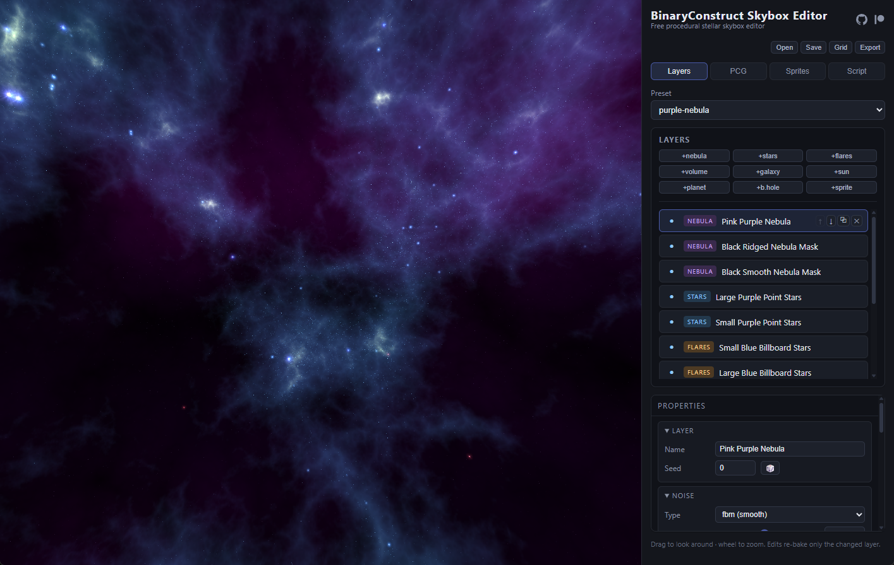
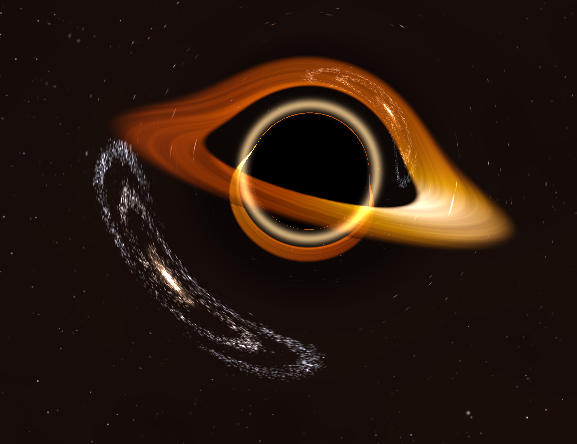

# BinaryConstruct Skybox

**Free procedural stellar skybox editor** — [skyboxeditor.com](https://skyboxeditor.com)

Layered nebulae, star fields, hero galaxies, positional suns/planets, and
gravitationally-lensed black holes, composited on a sky sphere and exported as
game-ready cubemaps. TypeScript + React + three.js/WebGL2, fully client-side —
no accounts, no servers, no telemetry.

> Skybox Editor is an independent TypeScript/WebGL2 rewrite inspired by the
> original [Spacescape](http://alexcpeterson.com/spacescape) project
> (Alex Peterson, MIT).



<p align="center">
  
</p>

## Features

- **Layer stack** composited with per-layer blend factors:
  `nebula` (seeded Perlin FBM/ridged, domain warp, multi-stop palettes),
  `volumetric` (raymarched emission/absorption), `stars` (deterministic
  points, blackbody colors, galactic band), `flares` (textured billboards,
  HYG catalog placement), `galaxy` (spiral particle clouds with ovoid bulge,
  dust, and HII regions), positional `sun` / `planet` / `sprite` quads, and
  `blackhole` — a lens layer applying true Schwarzschild geodesic deflection
  (LUT-sampled) to the scene behind it.
- **PCG workbench**: parameterized generators for stars (O–M classes, dwarfs,
  giants, pulsars, solar systems), galaxies (spiral/elliptical/edge-on/
  globular/interacting/deep-field), nebulae, planets (rocky/terran/gas), and
  anomalies (geodesic-traced black holes, TDEs, novae, quasars, magnetars…).
  Bake to sprites, drag onto the sky.
- **Deterministic**: same seed, same pixels — every generator runs on seeded
  RNG streams.
- **Script tab**: the whole scene as live two-way JSON with a published
  [schema](https://skyboxeditor.com/schema/scene.v2.schema.json) and
  line-precise validation — built for AI-assisted authoring (see
  [AI policy](AI_POLICY.md) and the
  [scene-authoring skill](.claude/skills/skybox-scenes/SKILL.md)).
- **Export**: 512–4096/face cube-face PNG zip, equirectangular PNG, Radiance
  `.hdr`, OpenEXR; per-layer and star-data exports; deterministic batch
  variation zips.
- **Legacy compatible**: imports original Spacescape `.xml` saves
  (MSVC `rand()` LCG + exact Perlin port). Saves are plain `.zip` bundles
  (project.json + sprites + preview).

## Develop

```sh
npm install
npm run dev     # http://localhost:5173  (?preset=<name> to deep-link)
npm test        # vitest (determinism, IO round-trips, geodesics, physics)
npm run build   # tsc + vite -> dist/
```

## Docs

- [`Docs/Instructions/USAGE.md`](Docs/Instructions/USAGE.md) — how to use the editor
- `Docs/EPIC-LIST.md` — high-level goals, status, and current focus
- `Docs/Design/` — durable design & architecture reference
- `Docs/Plans/` — task plans and PRDs with acceptance criteria
- `Docs/Research/` — research summaries backing the generators
- `Docs/Instructions/` — how-to docs (verification workflow, tooling)
- `golden/` — reference exports from the original Windows app
- [`AI_POLICY.md`](AI_POLICY.md) — how AI relates to this project

## License

[MIT](LICENSE) © BinaryConstruct.

Original Spacescape app © Alex Peterson (MIT); bundled flare textures and
presets derive from the original distribution.
